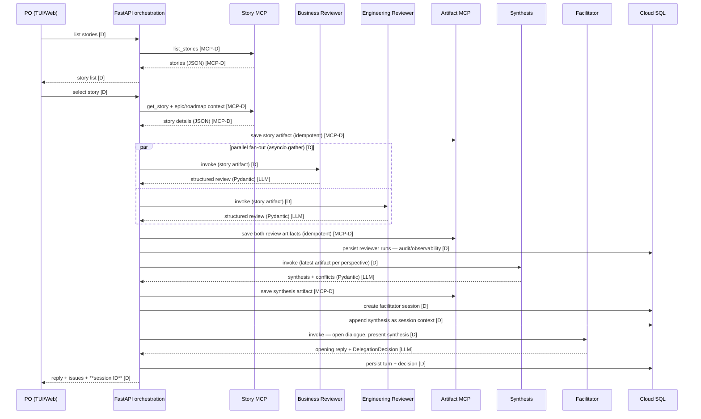
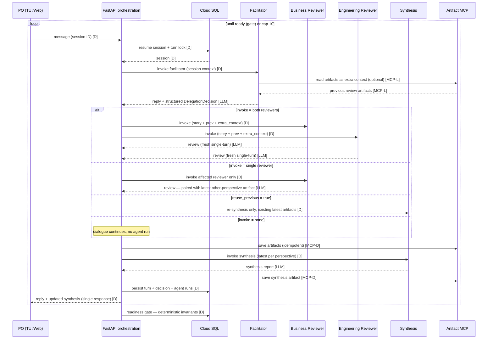

# Data Flow

Flows between UI, orchestration, agents, and MCP servers. Diagrams in Mermaid;
each is accompanied by a PlantUML-generated ASCII sequence diagram (sources in
`diagrams/`, regenerate with `plantuml -ttxt <flow>.puml`).
Legend: **[D]** = deterministic (plain Python, no LLM), **[LLM]** = LLM-driven call,
**[MCP-L]** = MCP call made by an agent (LLM-decided), **[MCP-D]** = direct MCP call
from orchestration code.

> **Design note**: all explicit invocations of the separately deployed agents come from
> the **orchestration layer** (application layer), not from agent-to-agent calls — a
> deliberate, defensible design keeping agents decoupled and independently testable
> (see pattern-decisions.md).

## 1. Initial flow — story selection triggers full review



This is **Pattern 2**: sequential base (reviews → synthesis → facilitator) with parallel
reviewer fan-out.

Sequence diagram (ASCII):

```
                                                                                                                                                                                             ,.-^^-._ 
                                                                                                                                                                                            |-.____.-|
                                                                                                                                                                                            |        |
                                                                                                                                                                                            |        |
     ,--.                       ,-------.                ,--------.           ,---------.          ,---------.          ,-----------.          ,---------.          ,-----------.           |        |
     |PO|                       |FastAPI|                |StoryMCP|           |BusReview|          |EngReview|          |ArtifactMCP|          |Synthesis|          |Facilitator|           '-.____.-'
     `-+'                       `---+---'                `----+---'           `----+----'          `----+----'          `-----+-----'          `----+----'          `-----+-----'           CloudSQL  
       |       list stories         |                         |                    |                    |                     |                     |                     |                     |     
       |--------------------------->|                         |                    |                    |                     |                     |                     |                     |     
       |                            |                         |                    |                    |                     |                     |                     |                     |     
       |                            |      list_stories       |                    |                    |                     |                     |                     |                     |     
       |                            |------------------------>|                    |                    |                     |                     |                     |                     |     
       |                            |                         |                    |                    |                     |                     |                     |                     |     
       |                            |     stories (JSON)      |                    |                    |                     |                     |                     |                     |     
       |                            |<- - - - - - - - - - - - |                    |                    |                     |                     |                     |                     |     
       |                            |                         |                    |                    |                     |                     |                     |                     |     
       |        story list          |                         |                    |                    |                     |                     |                     |                     |     
       |<- - - - - - - - - - - - - -|                         |                    |                    |                     |                     |                     |                     |     
       |                            |                         |                    |                    |                     |                     |                     |                     |     
       |       select story         |                         |                    |                    |                     |                     |                     |                     |     
       |--------------------------->|                         |                    |                    |                     |                     |                     |                     |     
       |                            |                         |                    |                    |                     |                     |                     |                     |     
       |                            |get_story + epic/roadmap |                    |                    |                     |                     |                     |                     |     
       |                            |------------------------>|                    |                    |                     |                     |                     |                     |     
       |                            |                         |                    |                    |                     |                     |                     |                     |     
       |                            |  story details (JSON)   |                    |                    |                     |                     |                     |                     |     
       |                            |<- - - - - - - - - - - - |                    |                    |                     |                     |                     |                     |     
       |                            |                         |                    |                    |                     |                     |                     |                     |     
       |                            |                        save story artifact (idempotent, run ID)   |                     |                     |                     |                     |     
       |                            |---------------------------------------------------------------------------------------->|                     |                     |                     |     
       |                            |                         |                    |                    |                     |                     |                     |                     |     
       |                            |                         |                    |                    |                     |                     |                     |                     |     
       |              _________________________________________________________________________________________________       |                     |                     |                     |     
       |              ! PAR  /  parallel fan-out (asyncio.gather)                  |                    |              !      |                     |                     |                     |     
       |              !_____/       |                         |                    |                    |              !      |                     |                     |                     |     
       |              !             |           invoke (story artifact)            |                    |              !      |                     |                     |                     |     
       |              !             |--------------------------------------------->|                    |              !      |                     |                     |                     |     
       |              !             |                         |                    |                    |              !      |                     |                     |                     |     
       |              !             |              review (Pydantic)               |                    |              !      |                     |                     |                     |     
       |              !             |<- - - - - - - - - - - - - - - - - - - - - - -|                    |              !      |                     |                     |                     |     
       |              !~~~~~~~~~~~~~~~~~~~~~~~~~~~~~~~~~~~~~~~~~~~~~~~~~~~~~~~~~~~~~~~~~~~~~~~~~~~~~~~~~~~~~~~~~~~~~~~~!      |                     |                     |                     |     
       |              !             |                         |                    |                    |              !      |                     |                     |                     |     
       |              !             |                     invoke (story artifact)  |                    |              !      |                     |                     |                     |     
       |              !             |------------------------------------------------------------------>|              !      |                     |                     |                     |     
       |              !             |                         |                    |                    |              !      |                     |                     |                     |     
       |              !             |                        review (Pydantic)     |                    |              !      |                     |                     |                     |     
       |              !             |<- - - - - - - - - - - - - - - - - - - - - - - - - - - - - - - - - |              !      |                     |                     |                     |     
       |              !~~~~~~~~~~~~~~~~~~~~~~~~~~~~~~~~~~~~~~~~~~~~~~~~~~~~~~~~~~~~~~~~~~~~~~~~~~~~~~~~~~~~~~~~~~~~~~~~!      |                     |                     |                     |     
       |                            |                         |                    |                    |                     |                     |                     |                     |     
       |                            |                        save both review artifacts (idempotent)    |                     |                     |                     |                     |     
       |                            |---------------------------------------------------------------------------------------->|                     |                     |                     |     
       |                            |                         |                    |                    |                     |                     |                     |                     |     
       |                            |                         |                    |               persist reviewer runs (audit)                    |                     |                     |     
       |                            |---------------------------------------------------------------------------------------------------------------------------------------------------------->|     
       |                            |                         |                    |                    |                     |                     |                     |                     |     
       |                            |                         |             invoke (latest per perspective)                   |                     |                     |                     |     
       |                            |-------------------------------------------------------------------------------------------------------------->|                     |                     |     
       |                            |                         |                    |                    |                     |                     |                     |                     |     
       |                            |                         |                  synthesis + conflicts  |                     |                     |                     |                     |     
       |                            |<- - - - - - - - - - - - - - - - - - - - - - - - - - - - - - - - - - - - - - - - - - - - - - - - - - - - - - - |                     |                     |     
       |                            |                         |                    |                    |                     |                     |                     |                     |     
       |                            |                         |      save synthesis artifact            |                     |                     |                     |                     |     
       |                            |---------------------------------------------------------------------------------------->|                     |                     |                     |     
       |                            |                         |                    |                    |                     |                     |                     |                     |     
       |                            |                         |                    |                 create facilitator session                     |                     |                     |     
       |                            |---------------------------------------------------------------------------------------------------------------------------------------------------------->|     
       |                            |                         |                    |                    |                     |                     |                     |                     |     
       |                            |                         |                    |                  append synthesis context|                     |                     |                     |     
       |                            |---------------------------------------------------------------------------------------------------------------------------------------------------------->|     
       |                            |                         |                    |                    |                     |                     |                     |                     |     
       |                            |                         |                   invoke (open dialogue, present synthesis)   |                     |                     |                     |     
       |                            |------------------------------------------------------------------------------------------------------------------------------------>|                     |     
       |                            |                         |                    |                    |                     |                     |                     |                     |     
       |                            |                         |                    |  opening reply + DelegationDecision      |                     |                     |                     |     
       |                            |<- - - - - - - - - - - - - - - - - - - - - - - - - - - - - - - - - - - - - - - - - - - - - - - - - - - - - - - - - - - - - - - - - - |                     |     
       |                            |                         |                    |                    |                     |                     |                     |                     |     
       |                            |                         |                    |                  persist turn + decision |                     |                     |                     |     
       |                            |---------------------------------------------------------------------------------------------------------------------------------------------------------->|     
       |                            |                         |                    |                    |                     |                     |                     |                     |     
       |reply + issues + session ID |                         |                    |                    |                     |                     |                     |                     |     
       |<- - - - - - - - - - - - - -|                         |                    |                    |                     |                     |                     |                     |     
     ,-+.                       ,---+---.                ,----+---.           ,----+----.          ,----+----.          ,-----+-----.          ,----+----.          ,-----+-----.           CloudSQL  
     |PO|                       |FastAPI|                |StoryMCP|           |BusReview|          |EngReview|          |ArtifactMCP|          |Synthesis|          |Facilitator|            ,.-^^-._ 
     `--'                       `-------'                `--------'           `---------'          `---------'          `-----------'          `---------'          `-----------'           |-.____.-|
                                                                                                                                                                                            |        |
                                                                                                                                                                                            |        |
                                                                                                                                                                                            |        |
                                                                                                                                                                                            '-.____.-'
```

## 2. Dialogue loop — facilitator, PO and LLM-driven delegation

Turn semantics: **one PO message = one request**. The turn holds a lock on the session;
a delegated re-review runs *within* the same request (covered by the 120 s dialogue
timeout) and the single response contains the facilitator reply plus — if a review was
delegated — the updated synthesis. No partial/double responses; concurrent messages on
the same session are rejected while a turn is in progress.



Pattern mapping of this flow:

- **Pattern 1**: separately deployed agents invoked explicitly (Agent Engine client
  SDK, from the orchestration layer — see design note above), in sequence, inside a loop.
- **Pattern 3**: the facilitator's DelegationDecision is LLM-driven delegation inside a
  User-in-the-Loop conversation; reviewer → synthesis is the simple sequential chain
  invoked from the hierarchy.
- **Loop safety cap**: 10 iterations max → story parked (see observability.md).
- Exit condition (deterministic gate, not LLM-trusted): all flagged issues resolved
  **or** explicit PO acceptance, and no review in progress.

`reuse_previous` semantics: `true` → re-synthesis only with existing latest artifacts
(`invoke` must be empty); `false` → invoked reviewers run and each new artifact is paired
with the latest artifact of the other perspective.

Sequence diagram (ASCII):

```
                                                                                                                    ,.-^^-._                                                                                                                        
                                                                                                                   |-.____.-|                                                                                                                       
                                                                                                                   |        |                                                                                                                       
                                                                                                                   |        |                                                                                                                       
                    ,--.                                       ,-------.                                           |        |          ,-----------.          ,---------.          ,---------.          ,---------.          ,-----------.          
                    |PO|                                       |FastAPI|                                           '-.____.-'          |Facilitator|          |BusReview|          |EngReview|          |Synthesis|          |ArtifactMCP|          
                    `-+'                                       `---+---'                                           CloudSQL            `-----+-----'          `----+----'          `----+----'          `----+----'          `-----+-----'          
                      |                                            |                                                   |                     |                     |                    |                    |                     |                
          _________________________________________________________________________________________________________________________________________________________________________________________________________________________________________ 
          ! LOOP  /  until ready (gate) or cap 10                  |                                                   |                     |                     |                    |                    |                     |               !
          !______/    |                                            |                                                   |                     |                     |                    |                    |                     |               !
          !           |           message (session ID)             |                                                   |                     |                     |                    |                    |                     |               !
          !           |------------------------------------------->|                                                   |                     |                     |                    |                    |                     |               !
          !           |                                            |                                                   |                     |                     |                    |                    |                     |               !
          !           |                                            |        resume session by ID (+turn lock)          |                     |                     |                    |                    |                     |               !
          !           |                                            |-------------------------------------------------->|                     |                     |                    |                    |                     |               !
          !           |                                            |                                                   |                     |                     |                    |                    |                     |               !
          !           |                                            |                     session                       |                     |                     |                    |                    |                     |               !
          !           |                                            |<- - - - - - - - - - - - - - - - - - - - - - - - - |                     |                     |                    |                    |                     |               !
          !           |                                            |                                                   |                     |                     |                    |                    |                     |               !
          !           |                                            |                        invoke (session context)   |                     |                     |                    |                    |                     |               !
          !           |                                            |------------------------------------------------------------------------>|                     |                    |                    |                     |               !
          !           |                                            |                                                   |                     |                     |                    |                    |                     |               !
          !           |                                            |                                                   |                     |                     read artifacts as extra context (optional)|                     |               !
          !           |                                            |                                                   |                     |------------------------------------------------------------------------------------>|               !
          !           |                                            |                                                   |                     |                     |                    |                    |                     |               !
          !           |                                            |                                                   |                     |                     |               artifacts                 |                     |               !
          !           |                                            |                                                   |                     |<- - - - - - - - - - - - - - - - - - - - - - - - - - - - - - - - - - - - - - - - - - |               !
          !           |                                            |                                                   |                     |                     |                    |                    |                     |               !
          !           |                                            |                       reply + DelegationDecision  |                     |                     |                    |                    |                     |               !
          !           |                                            |<- - - - - - - - - - - - - - - - - - - - - - - - - - - - - - - - - - - - |                     |                    |                    |                     |               !
          !           |                                            |                                                   |                     |                     |                    |                    |                     |               !
          !           |                                            |                                                   |                     |                     |                    |                    |                     |               !
          !           |                              _______________________________________________________________________________________________________________________________________________________________________       |               !
          !           |                              ! ALT  /  decision.invoke = both                                  |                     |                     |                    |                    |              !      |               !
          !           |                              !_____/       |                                                   |                     |                     |                    |                    |              !      |               !
          !           |                              !             |                            invoke (story + prev + extra_context)        |                     |                    |                    |              !      |               !
          !           |                              !             |---------------------------------------------------------------------------------------------->|                    |                    |              !      |               !
          !           |                              !             |                                                   |                     |                     |                    |                    |              !      |               !
          !           |                              !             |                                       invoke (story + prev + extra_context)                   |                    |                    |              !      |               !
          !           |                              !             |------------------------------------------------------------------------------------------------------------------->|                    |              !      |               !
          !           |                              !             |                                                   |                     |                     |                    |                    |              !      |               !
          !           |                              !             |                                            review |                     |                     |                    |                    |              !      |               !
          !           |                              !             |<- - - - - - - - - - - - - - - - - - - - - - - - - - - - - - - - - - - - - - - - - - - - - - - |                    |                    |              !      |               !
          !           |                              !             |                                                   |                     |                     |                    |                    |              !      |               !
          !           |                              !             |                                                   |  review             |                     |                    |                    |              !      |               !
          !           |                              !             |<- - - - - - - - - - - - - - - - - - - - - - - - - - - - - - - - - - - - - - - - - - - - - - - - - - - - - - - - - -|                    |              !      |               !
          !           |                              !~~~~~~~~~~~~~~~~~~~~~~~~~~~~~~~~~~~~~~~~~~~~~~~~~~~~~~~~~~~~~~~~~~~~~~~~~~~~~~~~~~~~~~~~~~~~~~~~~~~~~~~~~~~~~~~~~~~~~~~~~~~~~~~~~~~~~~~~~~~~~~~~~~~~~~~~~~~~~~~~~~~~~~!      |               !
          !           |                              ! [decision.invoke = single reviewer]                             |                     |                     |                    |                    |              !      |               !
          !           |                              !             |                                invoke affected reviewer only            |                     |                    |                    |              !      |               !
          !           |                              !             |---------------------------------------------------------------------------------------------->|                    |                    |              !      |               !
          !           |                              !             |                                                   |                     |                     |                    |                    |              !      |               !
          !           |                              !             |                    review (paired with latest other-perspective artifact)                     |                    |                    |              !      |               !
          !           |                              !             |<- - - - - - - - - - - - - - - - - - - - - - - - - - - - - - - - - - - - - - - - - - - - - - - |                    |                    |              !      |               !
          !           |                              !~~~~~~~~~~~~~~~~~~~~~~~~~~~~~~~~~~~~~~~~~~~~~~~~~~~~~~~~~~~~~~~~~~~~~~~~~~~~~~~~~~~~~~~~~~~~~~~~~~~~~~~~~~~~~~~~~~~~~~~~~~~~~~~~~~~~~~~~~~~~~~~~~~~~~~~~~~~~~~~~~~~~~~!      |               !
          !           |                              ! [reuse_previous = true]                                         |                     |                     |                    |                    |              !      |               !
          !           |                              !             |                                                 re-synthesis only (existing artifacts)        |                    |                    |              !      |               !
          !           |                              !             |---------------------------------------------------------------------------------------------------------------------------------------->|              !      |               !
          !           |                              !~~~~~~~~~~~~~~~~~~~~~~~~~~~~~~~~~~~~~~~~~~~~~~~~~~~~~~~~~~~~~~~~~~~~~~~~~~~~~~~~~~~~~~~~~~~~~~~~~~~~~~~~~~~~~~~~~~~~~~~~~~~~~~~~~~~~~~~~~~~~~~~~~~~~~~~~~~~~~~~~~~~~~~!      |               !
          !           |                              !~[invoke empty (no review)]~~~~~~~~~~~~~~~~~~~~~~~~~~~~~~~~~~~~~~~~~~~~~~~~~~~~~~~~~~~~~~~~~~~~~~~~~~~~~~~~~~~~~~~~~~~~~~~~~~~~~~~~~~~~~~~~~~~~~~~~~~~~~~~~~~~~~~~~~~~!      |               !
          !           |                                            |                                                   |                     |                     |                    |                    |                     |               !
          !           |                                            |                                                   |             save artifacts (idempotent)   |                    |                    |                     |               !
          !           |                                            |-------------------------------------------------------------------------------------------------------------------------------------------------------------->|               !
          !           |                                            |                                                   |                     |                     |                    |                    |                     |               !
          !           |                                            |                                               invoke synthesis (latest per perspective)       |                    |                    |                     |               !
          !           |                                            |---------------------------------------------------------------------------------------------------------------------------------------->|                     |               !
          !           |                                            |                                                   |                     |                     |                    |                    |                     |               !
          !           |                                            |                                                   |        synthesis report                   |                    |                    |                     |               !
          !           |                                            |<- - - - - - - - - - - - - - - - - - - - - - - - - - - - - - - - - - - - - - - - - - - - - - - - - - - - - - - - - - - - - - - - - - - - |                     |               !
          !           |                                            |                                                   |                     |                     |                    |                    |                     |               !
          !           |                                            |                                                   |               save synthesis artifact     |                    |                    |                     |               !
          !           |                                            |-------------------------------------------------------------------------------------------------------------------------------------------------------------->|               !
          !           |                                            |                                                   |                     |                     |                    |                    |                     |               !
          !           |                                            |           persist turn, decision, runs            |                     |                     |                    |                    |                     |               !
          !           |                                            |-------------------------------------------------->|                     |                     |                    |                    |                     |               !
          !           |                                            |                                                   |                     |                     |                    |                    |                     |               !
          !           |reply + updated synthesis (single response) |                                                   |                     |                     |                    |                    |                     |               !
          !           |<- - - - - - - - - - - - - - - - - - - - - -|                                                   |                     |                     |                    |                    |                     |               !
          !~~~~~~~~~~~~~~~~~~~~~~~~~~~~~~~~~~~~~~~~~~~~~~~~~~~~~~~~~~~~~~~~~~~~~~~~~~~~~~~~~~~~~~~~~~~~~~~~~~~~~~~~~~~~~~~~~~~~~~~~~~~~~~~~~~~~~~~~~~~~~~~~~~~~~~~~~~~~~~~~~~~~~~~~~~~~~~~~~~~~~~~~~~~~~~~~~~~~~~~~~~~~~~~~~~~~~~~~~~~~~~~~~~~~~~~~!
                      |                                            |                                                   |                     |                     |                    |                    |                     |                
                      |                                            |readiness gate: open_issues empty or PO acceptance |                     |                     |                    |                    |                     |                
                      |                                            |-------------------------------------------------->|                     |                     |                    |                    |                     |                
                    ,-+.                                       ,---+---.                                           CloudSQL            ,-----+-----.          ,----+----.          ,----+----.          ,----+----.          ,-----+-----.          
                    |PO|                                       |FastAPI|                                            ,.-^^-._           |Facilitator|          |BusReview|          |EngReview|          |Synthesis|          |ArtifactMCP|          
                    `--'                                       `-------'                                           |-.____.-|          `-----------'          `---------'          `---------'          `---------'          `-----------'          
                                                                                                                   |        |                                                                                                                       
                                                                                                                   |        |                                                                                                                       
                                                                                                                   |        |                                                                                                                       
                                                                                                                   '-.____.-'
```

## 3. Readiness — final report

Session states: `active` → `finalizing` → `completed`. The session is marked `completed`
only **after** the report artifact is successfully saved; a report failure leaves the
session in `finalizing`, retryable.

```mermaid
sequenceDiagram
    participant PO as PO (TUI/Web)
    participant F as FastAPI orchestration
    participant C as Cloud SQL
    participant T as Facilitator
    participant R as Report MCP
    participant G as GCS

    T-->>F: readiness = ready (proposal) [LLM]
    F->>C: deterministic gate: open_issues empty or PO acceptance; invoke = none [D]
    F->>C: session -> finalizing [D]
    F->>R: render report (MD/PDF) from synthesis artifacts [MCP-D]
    R->>G: save report artifact [D]
    R-->>F: artifact reference [MCP-D]
    F->>C: session -> completed [D]
    F-->>PO: final report download (signed URL) [D]
```

Sequence diagram (ASCII):

```
                                                                             ,.-^^-._                                                                
                                                                            |-.____.-|                                                               
                                                                            |        |                                                               
                                                                            |        |                                                               
     ,--.                        ,-------.                                  |        |          ,-----------.          ,---------.              ,---.
     |PO|                        |FastAPI|                                  '-.____.-'          |Facilitator|          |ReportMCP|              |GCS|
     `-+'                        `---+---'                                  CloudSQL            `-----+-----'          `----+----'              `-+-'
       |                             |                 readiness = ready (proposal)                   |                     |                     |  
       |                             |<- - - - - - - - - - - - - - - - - - - - - - - - - - - - - - - -|                     |                     |  
       |                             |                                          |                     |                     |                     |  
       |                             |readiness gate (deterministic invariants) |                     |                     |                     |  
       |                             |----------------------------------------->|                     |                     |                     |  
       |                             |                                          |                     |                     |                     |  
       |                             |          session -> finalizing           |                     |                     |                     |  
       |                             |----------------------------------------->|                     |                     |                     |  
       |                             |                                          |                     |                     |                     |  
       |                             |                   render report (MD/PDF) from synthesis artifacts                    |                     |  
       |                             |------------------------------------------------------------------------------------->|                     |  
       |                             |                                          |                     |                     |                     |  
       |                             |                                          |                     |                     |save report artifact |  
       |                             |                                          |                     |                     |-------------------->|  
       |                             |                                          |                     |                     |                     |  
       |                             |                                 artifact reference             |                     |                     |  
       |                             |<- - - - - - - - - - - - - - - - - - - - - - - - - - - - - - - - - - - - - - - - - - -|                     |  
       |                             |                                          |                     |                     |                     |  
       |                             |          session -> completed            |                     |                     |                     |  
       |                             |----------------------------------------->|                     |                     |                     |  
       |                             |                                          |                     |                     |                     |  
       |report download (signed URL) |                                          |                     |                     |                     |  
       |<- - - - - - - - - - - - - - |                                          |                     |                     |                     |  
     ,-+.                        ,---+---.                                  CloudSQL            ,-----+-----.          ,----+----.              ,-+-.
     |PO|                        |FastAPI|                                   ,.-^^-._           |Facilitator|          |ReportMCP|              |GCS|
     `--'                        `-------'                                  |-.____.-|          `-----------'          `---------'              `---'
                                                                            |        |                                                               
                                                                            |        |                                                               
                                                                            |        |                                                               
                                                                            '-.____.-'
```

## 4. Session restore — stateless server, client-held session ID

Cloud SQL returns the session history **including artifact references**; artifact
content is fetched through the Artifact MCP / GCS — history alone never carries
artifact payloads.

```mermaid
sequenceDiagram
    participant PO as PO (TUI/Web)
    participant F as FastAPI orchestration
    participant C as Cloud SQL
    participant A as Artifact MCP

    PO->>F: list sessions [D]
    F->>C: query sessions [D]
    C-->>F: sessions [D]
    F-->>PO: session list (story, date, status) [D]
    PO->>F: restore session ID [D]
    F->>C: load session history + artifact references [D]
    C-->>F: history [D]
    F->>A: fetch artifacts by reference [MCP-D]
    A-->>F: artifacts [MCP-D]
    F-->>PO: history replay + artifacts [D]
    note over PO,F: completed sessions are read-only; option: new session on same story
```

Sequence diagram (ASCII):

```
                                                                                          ,.-^^-._                        
                                                                                         |-.____.-|                       
                                                                                         |        |                       
                                                                                         |        |                       
     ,--.                              ,-------.                                         |        |          ,-----------.
     |PO|                              |FastAPI|                                         '-.____.-'          |ArtifactMCP|
     `-+'                              `---+---'                                         CloudSQL            `-----+-----'
       |          list sessions            |                                                 |                     |      
       |---------------------------------->|                                                 |                     |      
       |                                   |                                                 |                     |      
       |                                   |                 query sessions                  |                     |      
       |                                   |------------------------------------------------>|                     |      
       |                                   |                                                 |                     |      
       |                                   |                    sessions                     |                     |      
       |                                   |<- - - - - - - - - - - - - - - - - - - - - - - - |                     |      
       |                                   |                                                 |                     |      
       |session list (story, date, status) |                                                 |                     |      
       |<- - - - - - - - - - - - - - - - - |                                                 |                     |      
       |                                   |                                                 |                     |      
       |        restore session ID         |                                                 |                     |      
       |---------------------------------->|                                                 |                     |      
       |                                   |                                                 |                     |      
       |                                   |load session history (incl. artifact references) |                     |      
       |                                   |------------------------------------------------>|                     |      
       |                                   |                                                 |                     |      
       |                                   |                    history                      |                     |      
       |                                   |<- - - - - - - - - - - - - - - - - - - - - - - - |                     |      
       |                                   |                                                 |                     |      
       |                                   |                     fetch artifacts by reference|                     |      
       |                                   |---------------------------------------------------------------------->|      
       |                                   |                                                 |                     |      
       |                                   |                              artifacts          |                     |      
       |                                   |<- - - - - - - - - - - - - - - - - - - - - - - - - - - - - - - - - - - |      
       |                                   |                                                 |                     |      
       |    history replay + artifacts     |                                                 |                     |      
       |<- - - - - - - - - - - - - - - - - |                                                 |                     |      
       |                                   |                                                 |                     |      
   ,-----------------------------------------!.                                              |                     |      
   |completed sessions are read-only;        |_\                                             |                     |      
   |option: new session on same story          |                                             |                     |      
   `-------------------------------------------'                                         CloudSQL            ,-----+-----.
     |PO|                              |FastAPI|                                          ,.-^^-._           |ArtifactMCP|
     `--'                              `-------'                                         |-.____.-|          `-----------'
                                                                                         |        |                       
                                                                                         |        |                       
                                                                                         |        |                       
                                                                                         '-.____.-'
```

## Data stores and what flows where

| Store | Content | Written by | Read by |
|---|---|---|---|
| Backlog (mock data store) | stories, epic/roadmap context | dataset (git) | story MCP server |
| Cloud SQL (PostgreSQL) | facilitator conversation sessions, **all agent runs incl. single-turn reviewer runs (audit)** | FastAPI, Agent Engine | FastAPI (resume/list/restore) |
| GCS artifacts | story snapshot, review artifacts, synthesis reports, final MD/PDF reports | artifact MCP, report MCP | orchestration, facilitator agent, UI |

## Cross-cutting on every arrow

- Correlation ID (session, story, agent, attempt) on all calls — logs, traces, metrics.
- Agent version label on every agent invocation.
- Retries/timeouts per `observability.md` (never applied to PO input).
- **Idempotency**: every write carries a stable run ID / idempotency key (artifact saves,
  session creation, context appends, report generation); retries are safe — no duplicate
  artifacts, sessions or dialogue events. Unique constraints in Cloud SQL; turn locks
  serialize writes per session.
- All payloads Pydantic-validated; validation failure = observability event.
