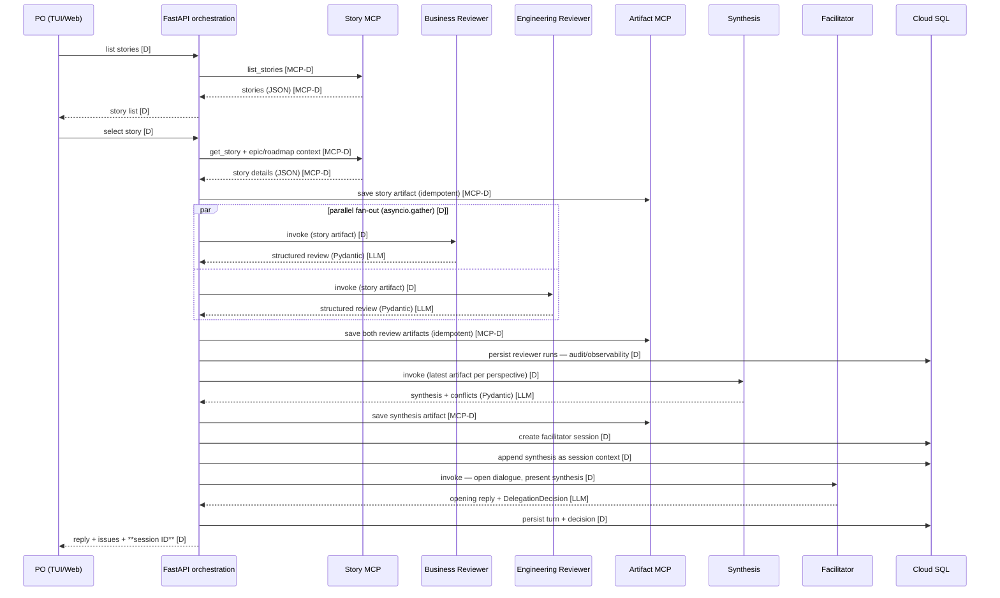
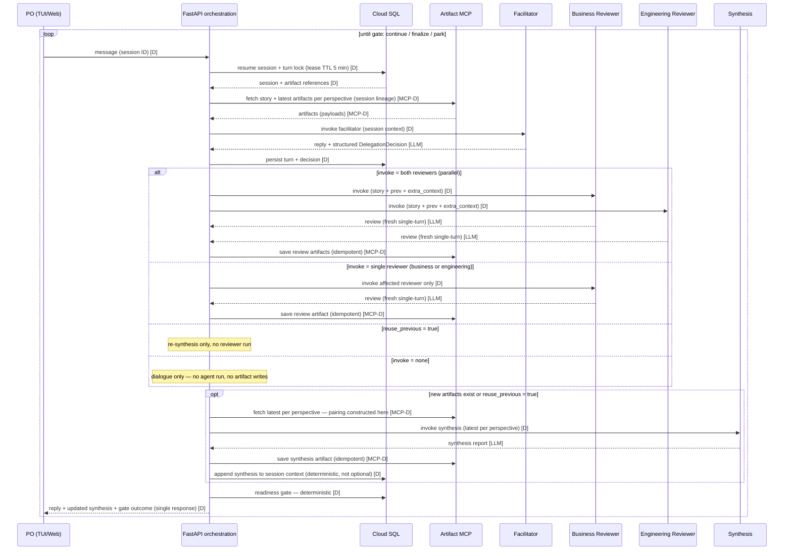
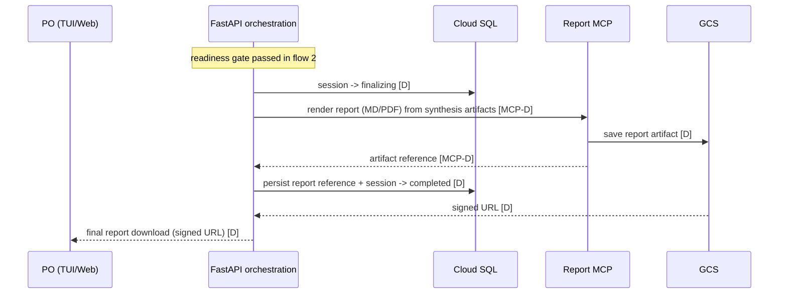

# Data Flow

Flows between UI, orchestration, agents, and MCP servers. Diagrams in Mermaid;
each is accompanied by a PlantUML-generated ASCII sequence diagram (sources in
`diagrams/`, regenerate with `plantuml -ttxt <flow>.puml`).
Legend: **[D]** = deterministic (plain Python, no LLM), **[LLM]** = LLM-driven call,
**[MCP-L]** = MCP call made by an agent (LLM-decided), **[MCP-D]** = direct MCP call
from orchestration code.

> **Design note**: all explicit invocations of the separately deployed agents come from
> the **orchestration layer** (application layer), not from agent-to-agent calls — a
> deliberate, defensible design keeping agents decoupled and independently testable
> (see pattern-decisions.md).

## 1. Initial flow — story selection triggers full review



Constraint: the opening facilitator turn always emits `invoke` = none — the first
re-review can only be requested from turn 2 onward, inside the dialogue loop.

This is **Pattern 2**: sequential base (reviews → synthesis → facilitator) with parallel
reviewer fan-out.

Sequence diagram (ASCII):

```
                                                                                                                                                                                             ,.-^^-._ 
                                                                                                                                                                                            |-.____.-|
                                                                                                                                                                                            |        |
                                                                                                                                                                                            |        |
     ,--.                       ,-------.                ,--------.           ,---------.          ,---------.          ,-----------.          ,---------.          ,-----------.           |        |
     |PO|                       |FastAPI|                |StoryMCP|           |BusReview|          |EngReview|          |ArtifactMCP|          |Synthesis|          |Facilitator|           '-.____.-'
     `-+'                       `---+---'                `----+---'           `----+----'          `----+----'          `-----+-----'          `----+----'          `-----+-----'           CloudSQL  
       |       list stories         |                         |                    |                    |                     |                     |                     |                     |     
       |--------------------------->|                         |                    |                    |                     |                     |                     |                     |     
       |                            |                         |                    |                    |                     |                     |                     |                     |     
       |                            |      list_stories       |                    |                    |                     |                     |                     |                     |     
       |                            |------------------------>|                    |                    |                     |                     |                     |                     |     
       |                            |                         |                    |                    |                     |                     |                     |                     |     
       |                            |     stories (JSON)      |                    |                    |                     |                     |                     |                     |     
       |                            |<- - - - - - - - - - - - |                    |                    |                     |                     |                     |                     |     
       |                            |                         |                    |                    |                     |                     |                     |                     |     
       |        story list          |                         |                    |                    |                     |                     |                     |                     |     
       |<- - - - - - - - - - - - - -|                         |                    |                    |                     |                     |                     |                     |     
       |                            |                         |                    |                    |                     |                     |                     |                     |     
       |       select story         |                         |                    |                    |                     |                     |                     |                     |     
       |--------------------------->|                         |                    |                    |                     |                     |                     |                     |     
       |                            |                         |                    |                    |                     |                     |                     |                     |     
       |                            |get_story + epic/roadmap |                    |                    |                     |                     |                     |                     |     
       |                            |------------------------>|                    |                    |                     |                     |                     |                     |     
       |                            |                         |                    |                    |                     |                     |                     |                     |     
       |                            |  story details (JSON)   |                    |                    |                     |                     |                     |                     |     
       |                            |<- - - - - - - - - - - - |                    |                    |                     |                     |                     |                     |     
       |                            |                         |                    |                    |                     |                     |                     |                     |     
       |                            |                        save story artifact (idempotent, run ID)   |                     |                     |                     |                     |     
       |                            |---------------------------------------------------------------------------------------->|                     |                     |                     |     
       |                            |                         |                    |                    |                     |                     |                     |                     |     
       |                            |                         |                    |                    |                     |                     |                     |                     |     
       |              _________________________________________________________________________________________________       |                     |                     |                     |     
       |              ! PAR  /  parallel fan-out (asyncio.gather)                  |                    |              !      |                     |                     |                     |     
       |              !_____/       |                         |                    |                    |              !      |                     |                     |                     |     
       |              !             |           invoke (story artifact)            |                    |              !      |                     |                     |                     |     
       |              !             |--------------------------------------------->|                    |              !      |                     |                     |                     |     
       |              !             |                         |                    |                    |              !      |                     |                     |                     |     
       |              !             |              review (Pydantic)               |                    |              !      |                     |                     |                     |     
       |              !             |<- - - - - - - - - - - - - - - - - - - - - - -|                    |              !      |                     |                     |                     |     
       |              !~~~~~~~~~~~~~~~~~~~~~~~~~~~~~~~~~~~~~~~~~~~~~~~~~~~~~~~~~~~~~~~~~~~~~~~~~~~~~~~~~~~~~~~~~~~~~~~~!      |                     |                     |                     |     
       |              !             |                         |                    |                    |              !      |                     |                     |                     |     
       |              !             |                     invoke (story artifact)  |                    |              !      |                     |                     |                     |     
       |              !             |------------------------------------------------------------------>|              !      |                     |                     |                     |     
       |              !             |                         |                    |                    |              !      |                     |                     |                     |     
       |              !             |                        review (Pydantic)     |                    |              !      |                     |                     |                     |     
       |              !             |<- - - - - - - - - - - - - - - - - - - - - - - - - - - - - - - - - |              !      |                     |                     |                     |     
       |              !~~~~~~~~~~~~~~~~~~~~~~~~~~~~~~~~~~~~~~~~~~~~~~~~~~~~~~~~~~~~~~~~~~~~~~~~~~~~~~~~~~~~~~~~~~~~~~~~!      |                     |                     |                     |     
       |                            |                         |                    |                    |                     |                     |                     |                     |     
       |                            |                        save both review artifacts (idempotent)    |                     |                     |                     |                     |     
       |                            |---------------------------------------------------------------------------------------->|                     |                     |                     |     
       |                            |                         |                    |                    |                     |                     |                     |                     |     
       |                            |                         |                    |               persist reviewer runs (audit)                    |                     |                     |     
       |                            |---------------------------------------------------------------------------------------------------------------------------------------------------------->|     
       |                            |                         |                    |                    |                     |                     |                     |                     |     
       |                            |                         |             invoke (latest per perspective)                   |                     |                     |                     |     
       |                            |-------------------------------------------------------------------------------------------------------------->|                     |                     |     
       |                            |                         |                    |                    |                     |                     |                     |                     |     
       |                            |                         |                  synthesis + conflicts  |                     |                     |                     |                     |     
       |                            |<- - - - - - - - - - - - - - - - - - - - - - - - - - - - - - - - - - - - - - - - - - - - - - - - - - - - - - - |                     |                     |     
       |                            |                         |                    |                    |                     |                     |                     |                     |     
       |                            |                         |      save synthesis artifact            |                     |                     |                     |                     |     
       |                            |---------------------------------------------------------------------------------------->|                     |                     |                     |     
       |                            |                         |                    |                    |                     |                     |                     |                     |     
       |                            |                         |                    |                 create facilitator session                     |                     |                     |     
       |                            |---------------------------------------------------------------------------------------------------------------------------------------------------------->|     
       |                            |                         |                    |                    |                     |                     |                     |                     |     
       |                            |                         |                    |                  append synthesis context|                     |                     |                     |     
       |                            |---------------------------------------------------------------------------------------------------------------------------------------------------------->|     
       |                            |                         |                    |                    |                     |                     |                     |                     |     
       |                            |                         |                   invoke (open dialogue, present synthesis)   |                     |                     |                     |     
       |                            |------------------------------------------------------------------------------------------------------------------------------------>|                     |     
       |                            |                         |                    |                    |                     |                     |                     |                     |     
       |                            |                         |                    |  opening reply + DelegationDecision      |                     |                     |                     |     
       |                            |<- - - - - - - - - - - - - - - - - - - - - - - - - - - - - - - - - - - - - - - - - - - - - - - - - - - - - - - - - - - - - - - - - - |                     |     
       |                            |                         |                    |                    |                     |                     |                     |                     |     
       |                            |                         |                    |                  persist turn + decision |                     |                     |                     |     
       |                            |---------------------------------------------------------------------------------------------------------------------------------------------------------->|     
       |                            |                         |                    |                    |                     |                     |                     |                     |     
       |reply + issues + session ID |                         |                    |                    |                     |                     |                     |                     |     
       |<- - - - - - - - - - - - - -|                         |                    |                    |                     |                     |                     |                     |     
     ,-+.                       ,---+---.                ,----+---.           ,----+----.          ,----+----.          ,-----+-----.          ,----+----.          ,-----+-----.           CloudSQL  
     |PO|                       |FastAPI|                |StoryMCP|           |BusReview|          |EngReview|          |ArtifactMCP|          |Synthesis|          |Facilitator|            ,.-^^-._ 
     `--'                       `-------'                `--------'           `---------'          `---------'          `-----------'          `---------'          `-----------'           |-.____.-|
                                                                                                                                                                                            |        |
                                                                                                                                                                                            |        |
                                                                                                                                                                                            |        |
                                                                                                                                                                                            '-.____.-'
```

## 2. Dialogue loop — facilitator, PO and LLM-driven delegation

Turn semantics: **one PO message = one request**. The turn takes a **lease-based lock**
on the session (TTL 5 min, released after the response; a crashed holder expires with
the lease — no permanently busy sessions). Concurrent messages on a locked session are
rejected. The request has an **end-to-end deadline of 5 min** (covering delegated
reviews, synthesis and their retries); the 120 s timeout applies only to the single
facilitator LLM call. Input assembly is deterministic: FastAPI fetches story and latest
artifacts (scoped to the **session lineage** of this story run — never a global
"latest") via the Artifact MCP before invoking any agent.



Gate semantics (evaluated **before** the response is sent):

- `finalize` when: (`open_issues` empty AND `invoke` = none) **or** `po_accepted` flag
  is set — the flag comes from an **explicit client action** (UI button/API field), never
  from the LLM.
- `park` when the loop cap (10) is reached — no gate evaluation, story parked.
- Otherwise: `continue` (next turn).

Pattern mapping of this flow:

- **Pattern 1**: separately deployed agents invoked explicitly (Agent Engine client
  SDK, from the orchestration layer — see design note above), in sequence, inside a loop.
- **Pattern 3**: the facilitator's DelegationDecision is LLM-driven delegation inside a
  User-in-the-Loop conversation; reviewer → synthesis is the simple sequential chain
  invoked from the hierarchy.

Synthesis is invoked **at most once per turn**, only when new artifacts exist or
`reuse_previous` = true. Updated synthesis is **always** appended to the session context
so the facilitator never continues from stale state.

Sequence diagram (ASCII):

```
                                                                                                                                    ,.-^^-._                                                                                                                                  
                                                                                                                                   |-.____.-|                                                                                                                                 
                                                                                                                                   |        |                                                                                                                                 
                                                                                                                                   |        |                                                                                                                                 
                    ,--.                                                      ,-------.                                            |        |          ,-----------.          ,-----------.          ,---------.          ,---------.          ,---------.                    
                    |PO|                                                      |FastAPI|                                            '-.____.-'          |ArtifactMCP|          |Facilitator|          |BusReview|          |EngReview|          |Synthesis|                    
                    `-+'                                                      `---+---'                                            CloudSQL            `-----+-----'          `-----+-----'          `----+----'          `----+----'          `----+----'                    
                      |                                                           |                                                    |                     |                      |                     |                    |                    |                         
          ___________________________________________________________________________________________________________________________________________________________________________________________________________________________________________________________________ 
          ! LOOP  /  until gate: continue / finalize / park                       |                                                    |                     |                      |                     |                    |                    |                        !
          !______/    |                                                           |                                                    |                     |                      |                     |                    |                    |                        !
          !           |                   message (session ID)                    |                                                    |                     |                      |                     |                    |                    |                        !
          !           |---------------------------------------------------------->|                                                    |                     |                      |                     |                    |                    |                        !
          !           |                                                           |                                                    |                     |                      |                     |                    |                    |                        !
          !           |                                                           |   resume session + turn lock (lease TTL 5 min)     |                     |                      |                     |                    |                    |                        !
          !           |                                                           |--------------------------------------------------->|                     |                      |                     |                    |                    |                        !
          !           |                                                           |                                                    |                     |                      |                     |                    |                    |                        !
          !           |                                                           |           session + artifact references            |                     |                      |                     |                    |                    |                        !
          !           |                                                           |<- - - - - - - - - - - - - - - - - - - - - - - - - -|                     |                      |                     |                    |                    |                        !
          !           |                                                           |                                                    |                     |                      |                     |                    |                    |                        !
          !           |                                                           |    fetch story + latest artifacts per perspective (session lineage)      |                      |                     |                    |                    |                        !
          !           |                                                           |------------------------------------------------------------------------->|                      |                     |                    |                    |                        !
          !           |                                                           |                                                    |                     |                      |                     |                    |                    |                        !
          !           |                                                           |                          artifacts (payloads)      |                     |                      |                     |                    |                    |                        !
          !           |                                                           |<- - - - - - - - - - - - - - - - - - - - - - - - - - - - - - - - - - - - -|                      |                     |                    |                    |                        !
          !           |                                                           |                                                    |                     |                      |                     |                    |                    |                        !
          !           |                                                           |                                    invoke (session context)              |                      |                     |                    |                    |                        !
          !           |                                                           |------------------------------------------------------------------------------------------------>|                     |                    |                    |                        !
          !           |                                                           |                                                    |                     |                      |                     |                    |                    |                        !
          !           |                                                           |                                   reply + DelegationDecision             |                      |                     |                    |                    |                        !
          !           |                                                           |<- - - - - - - - - - - - - - - - - - - - - - - - - - - - - - - - - - - - - - - - - - - - - - - - |                     |                    |                    |                        !
          !           |                                                           |                                                    |                     |                      |                     |                    |                    |                        !
          !           |                                                           |              persist turn + decision               |                     |                      |                     |                    |                    |                        !
          !           |                                                           |--------------------------------------------------->|                     |                      |                     |                    |                    |                        !
          !           |                                                           |                                                    |                     |                      |                     |                    |                    |                        !
          !           |                                                           |                                                    |                     |                      |                     |                    |                    |                        !
          !           |                                             __________________________________________________________________________________________________________________________________________________________________________      |                        !
          !           |                                             ! ALT  /  invoke = both reviewers (parallel)                       |                     |                      |                     |                    |              !     |                        !
          !           |                                             !_____/       |                                                    |                     |                      |                     |                    |              !     |                        !
          !           |                                             !             |                                        invoke (story + prev + extra_context)                    |                     |                    |              !     |                        !
          !           |                                             !             |---------------------------------------------------------------------------------------------------------------------->|                    |              !     |                        !
          !           |                                             !             |                                                    |                     |                      |                     |                    |              !     |                        !
          !           |                                             !             |                                                   invoke (story + prev + extra_context)         |                     |                    |              !     |                        !
          !           |                                             !             |------------------------------------------------------------------------------------------------------------------------------------------->|              !     |                        !
          !           |                                             !             |                                                    |                     |                      |                     |                    |              !     |                        !
          !           |                                             !             |                                                    |   review            |                      |                     |                    |              !     |                        !
          !           |                                             !             |<- - - - - - - - - - - - - - - - - - - - - - - - - - - - - - - - - - - - - - - - - - - - - - - - - - - - - - - - - - - |                    |              !     |                        !
          !           |                                             !             |                                                    |                     |                      |                     |                    |              !     |                        !
          !           |                                             !             |                                                    |             review  |                      |                     |                    |              !     |                        !
          !           |                                             !             |<- - - - - - - - - - - - - - - - - - - - - - - - - - - - - - - - - - - - - - - - - - - - - - - - - - - - - - - - - - - - - - - - - - - - - -|              !     |                        !
          !           |                                             !             |                                                    |                     |                      |                     |                    |              !     |                        !
          !           |                                             !             |                   save review artifacts (idempotent)                     |                      |                     |                    |              !     |                        !
          !           |                                             !             |------------------------------------------------------------------------->|                      |                     |                    |              !     |                        !
          !           |                                             !~~~~~~~~~~~~~~~~~~~~~~~~~~~~~~~~~~~~~~~~~~~~~~~~~~~~~~~~~~~~~~~~~~~~~~~~~~~~~~~~~~~~~~~~~~~~~~~~~~~~~~~~~~~~~~~~~~~~~~~~~~~~~~~~~~~~~~~~~~~~~~~~~~~~~~~~~~~~~~~~~~~~~~~~~!     |                        !
          !           |                                             ! [invoke = single reviewer (business or engineering)]             |                     |                      |                     |                    |              !     |                        !
          !           |                                             !             |                               invoke affected reviewer (story + prev + extra_context)           |                     |                    |              !     |                        !
          !           |                                             !             |---------------------------------------------------------------------------------------------------------------------->|                    |              !     |                        !
          !           |                                             !             |                                                    |                     |                      |                     |                    |              !     |                        !
          !           |                                             !             |                                                    |   review            |                      |                     |                    |              !     |                        !
          !           |                                             !             |<- - - - - - - - - - - - - - - - - - - - - - - - - - - - - - - - - - - - - - - - - - - - - - - - - - - - - - - - - - - |                    |              !     |                        !
          !           |                                             !             |                                                    |                     |                      |                     |                    |              !     |                        !
          !           |                                             !             |                    save review artifact (idempotent)                     |                      |                     |                    |              !     |                        !
          !           |                                             !             |------------------------------------------------------------------------->|                      |                     |                    |              !     |                        !
          !           |                                             !~~~~~~~~~~~~~~~~~~~~~~~~~~~~~~~~~~~~~~~~~~~~~~~~~~~~~~~~~~~~~~~~~~~~~~~~~~~~~~~~~~~~~~~~~~~~~~~~~~~~~~~~~~~~~~~~~~~~~~~~~~~~~~~~~~~~~~~~~~~~~~~~~~~~~~~~~~~~~~~~~~~~~~~~~!     |                        !
          !           |                                             !~~~~~~~~~~~~~~~~~~~~~~~~~~~~~~~~~~~~~~~~~~~~~~~~~~~~~~~~~~~~~~~~~~~~~~~~~~~~~~~~~~~~~~~~~~~~~~~~~~~~~~~~~~~~~~~~~~~~~~~~~~~~~~~~~~~~~~~~~~~~~~~~~~~~~~~~~~~~~~~~~~~~~~~~~!     |                        !
          !           |                                             !~[invoke = none (dialogue only)]~~~~~~~~~~~~~~~~~~~~~~~~~~~~~~~~~~~~~~~~~~~~~~~~~~~~~~~~~~~~~~~~~~~~~~~~~~~~~~~~~~~~~~~~~~~~~~~~~~~~~~~~~~~~~~~~~~~~~~~~~~~~~~~~~~~~~~~~~!     |                        !
          !           |                                                           |                                                    |                     |                      |                     |                    |                    |                        !
          !           |                                                           |                                                    |                     |                      |                     |                    |                    |                        !
          !           |                                             _______________________________________________________________________________________________________________________________________________________________________________________________          !
          !           |                                             ! OPT  /  new artifacts exist or reuse_previous                    |                     |                      |                     |                    |                    |              !         !
          !           |                                             !_____/       |                                                    |                     |                      |                     |                    |                    |              !         !
          !           |                                             !             |            fetch latest per perspective (pairing done here)              |                      |                     |                    |                    |              !         !
          !           |                                             !             |------------------------------------------------------------------------->|                      |                     |                    |                    |              !         !
          !           |                                             !             |                                                    |                     |                      |                     |                    |                    |              !         !
          !           |                                             !             |                                                    |      invoke synthesis (latest per perspective)                   |                    |                    |              !         !
          !           |                                             !             |---------------------------------------------------------------------------------------------------------------------------------------------------------------->|              !         !
          !           |                                             !             |                                                    |                     |                      |                     |                    |                    |              !         !
          !           |                                             !             |                                                    |                   synthesis report         |                     |                    |                    |              !         !
          !           |                                             !             |<- - - - - - - - - - - - - - - - - - - - - - - - - - - - - - - - - - - - - - - - - - - - - - - - - - - - - - - - - - - - - - - - - - - - - - - - - - - - - - - - |              !         !
          !           |                                             !             |                                                    |                     |                      |                     |                    |                    |              !         !
          !           |                                             !             |                  save synthesis artifact (idempotent)                    |                      |                     |                    |                    |              !         !
          !           |                                             !             |------------------------------------------------------------------------->|                      |                     |                    |                    |              !         !
          !           |                                             !             |                                                    |                     |                      |                     |                    |                    |              !         !
          !           |                                             !             |append synthesis to session context (deterministic) |                     |                      |                     |                    |                    |              !         !
          !           |                                             !             |--------------------------------------------------->|                     |                      |                     |                    |                    |              !         !
          !           |                                             !~~~~~~~~~~~~~~~~~~~~~~~~~~~~~~~~~~~~~~~~~~~~~~~~~~~~~~~~~~~~~~~~~~~~~~~~~~~~~~~~~~~~~~~~~~~~~~~~~~~~~~~~~~~~~~~~~~~~~~~~~~~~~~~~~~~~~~~~~~~~~~~~~~~~~~~~~~~~~~~~~~~~~~~~~~~~~~~~~~~~~~~~~~~~~~!         !
          !           |                                                           |                                                    |                     |                      |                     |                    |                    |                        !
          !           |                                                           |          readiness gate (deterministic)            |                     |                      |                     |                    |                    |                        !
          !           |                                                           |--------------------------------------------------->|                     |                      |                     |                    |                    |                        !
          !           |                                                           |                                                    |                     |                      |                     |                    |                    |                        !
          !           |reply + updated synthesis + gate outcome (single response) |                                                    |                     |                      |                     |                    |                    |                        !
          !           |<- - - - - - - - - - - - - - - - - - - - - - - - - - - - - |                                                    |                     |                      |                     |                    |                    |                        !
          !~~~~~~~~~~~~~~~~~~~~~~~~~~~~~~~~~~~~~~~~~~~~~~~~~~~~~~~~~~~~~~~~~~~~~~~~~~~~~~~~~~~~~~~~~~~~~~~~~~~~~~~~~~~~~~~~~~~~~~~~~~~~~~~~~~~~~~~~~~~~~~~~~~~~~~~~~~~~~~~~~~~~~~~~~~~~~~~~~~~~~~~~~~~~~~~~~~~~~~~~~~~~~~~~~~~~~~~~~~~~~~~~~~~~~~~~~~~~~~~~~~~~~~~~~~~~~~~~~~!
                      |                                                           |                                                    |                     |                      |                     |                    |                    |                         
                      |                                                           | ,----------------------------------------!.        |                     |                      |                     |                    |                    |                         
                      |                                                           | |gate: open_issues empty AND invoke=none |_\       |                     |                      |                     |                    |                    |                         
                      |                                                           | |-> finalize (flow 3);                     |       |                     |                      |                     |                    |                    |                         
                      |                                                           | |po_accepted (client action) -> finalize;  |       |                     |                      |                     |                    |                    |                         
                      |                                                           | |loop cap 10 -> park (no gate)             |       |                     |                      |                     |                    |                    |                         
                    ,-+.                                                      ,---+-`------------------------------------------'   CloudSQL            ,-----+-----.          ,-----+-----.          ,----+----.          ,----+----.          ,----+----.                    
                    |PO|                                                      |FastAPI|                                             ,.-^^-._           |ArtifactMCP|          |Facilitator|          |BusReview|          |EngReview|          |Synthesis|                    
                    `--'                                                      `-------'                                            |-.____.-|          `-----------'          `-----------'          `---------'          `---------'          `---------'                    
                                                                                                                                   |        |                                                                                                                                 
                                                                                                                                   |        |                                                                                                                                 
                                                                                                                                   |        |                                                                                                                                 
                                                                                                                                   '-.____.-'
```

## 3. Readiness — final report

Triggered by the gate outcome `finalize` from flow 2 (no second facilitator event).
Session states: `active` → `finalizing` → `completed`. The session is marked `completed`
only **after** the report artifact is saved and its reference persisted; a report
failure leaves the session in `finalizing`, retryable. The signed URL is produced from
the GCS artifact.



Sequence diagram (ASCII):

```
                                                                                         ,.-^^-._                                         
                                                                                        |-.____.-|                                        
                                                                                        |        |                                        
                                                                                        |        |                                        
     ,--.                              ,-------.                                        |        |          ,---------.              ,---.
     |PO|                              |FastAPI|                                        '-.____.-'          |ReportMCP|              |GCS|
     `-+'                              `---+---'                                        CloudSQL            `----+----'              `-+-'
       |                                   |        readiness gate passed in flow 2         |                    |                     |  
       |                                   |----------------------------------------------->|                    |                     |  
       |                                   |                                                |                    |                     |  
       |                                   |             session -> finalizing              |                    |                     |  
       |                                   |----------------------------------------------->|                    |                     |  
       |                                   |                                                |                    |                     |  
       |                                   |          render report (MD/PDF) from synthesis artifacts            |                     |  
       |                                   |-------------------------------------------------------------------->|                     |  
       |                                   |                                                |                    |                     |  
       |                                   |                                                |                    |save report artifact |  
       |                                   |                                                |                    |-------------------->|  
       |                                   |                                                |                    |                     |  
       |                                   |                         artifact reference     |                    |                     |  
       |                                   |<- - - - - - - - - - - - - - - - - - - - - - - - - - - - - - - - - - |                     |  
       |                                   |                                                |                    |                     |  
       |                                   |persist report reference + session -> completed |                    |                     |  
       |                                   |----------------------------------------------->|                    |                     |  
       |                                   |                                                |                    |                     |  
       |                                   |                                        signed URL                   |                     |  
       |                                   |<- - - - - - - - - - - - - - - - - - - - - - - - - - - - - - - - - - - - - - - - - - - - - |  
       |                                   |                                                |                    |                     |  
       |final report download (signed URL) |                                                |                    |                     |  
       |<- - - - - - - - - - - - - - - - - |                                                |                    |                     |  
     ,-+.                              ,---+---.                                        CloudSQL            ,----+----.              ,-+-.
     |PO|                              |FastAPI|                                         ,.-^^-._           |ReportMCP|              |GCS|
     `--'                              `-------'                                        |-.____.-|          `---------'              `---'
                                                                                        |        |                                        
                                                                                        |        |                                        
                                                                                        |        |                                        
                                                                                        '-.____.-'
```

## 4. Session restore — stateless server, client-held session ID

Cloud SQL returns the session history **including artifact references**; artifact
content is fetched through the Artifact MCP / GCS — history alone never carries
artifact payloads.

```mermaid
sequenceDiagram
    participant PO as PO (TUI/Web)
    participant F as FastAPI orchestration
    participant C as Cloud SQL
    participant A as Artifact MCP

    PO->>F: list sessions [D]
    F->>C: query sessions [D]
    C-->>F: sessions [D]
    F-->>PO: session list (story, date, status) [D]
    PO->>F: restore session ID [D]
    F->>C: load session history + artifact references [D]
    C-->>F: history [D]
    F->>A: fetch artifacts by reference [MCP-D]
    A-->>F: artifacts [MCP-D]
    F-->>PO: history replay + artifacts [D]
    note over PO,F: completed sessions are read-only; option: new session on same story
```

Sequence diagram (ASCII):

```
                                                                                          ,.-^^-._                        
                                                                                         |-.____.-|                       
                                                                                         |        |                       
                                                                                         |        |                       
     ,--.                              ,-------.                                         |        |          ,-----------.
     |PO|                              |FastAPI|                                         '-.____.-'          |ArtifactMCP|
     `-+'                              `---+---'                                         CloudSQL            `-----+-----'
       |          list sessions            |                                                 |                     |      
       |---------------------------------->|                                                 |                     |      
       |                                   |                                                 |                     |      
       |                                   |                 query sessions                  |                     |      
       |                                   |------------------------------------------------>|                     |      
       |                                   |                                                 |                     |      
       |                                   |                    sessions                     |                     |      
       |                                   |<- - - - - - - - - - - - - - - - - - - - - - - - |                     |      
       |                                   |                                                 |                     |      
       |session list (story, date, status) |                                                 |                     |      
       |<- - - - - - - - - - - - - - - - - |                                                 |                     |      
       |                                   |                                                 |                     |      
       |        restore session ID         |                                                 |                     |      
       |---------------------------------->|                                                 |                     |      
       |                                   |                                                 |                     |      
       |                                   |load session history (incl. artifact references) |                     |      
       |                                   |------------------------------------------------>|                     |      
       |                                   |                                                 |                     |      
       |                                   |                    history                      |                     |      
       |                                   |<- - - - - - - - - - - - - - - - - - - - - - - - |                     |      
       |                                   |                                                 |                     |      
       |                                   |                     fetch artifacts by reference|                     |      
       |                                   |---------------------------------------------------------------------->|      
       |                                   |                                                 |                     |      
       |                                   |                              artifacts          |                     |      
       |                                   |<- - - - - - - - - - - - - - - - - - - - - - - - - - - - - - - - - - - |      
       |                                   |                                                 |                     |      
       |    history replay + artifacts     |                                                 |                     |      
       |<- - - - - - - - - - - - - - - - - |                                                 |                     |      
       |                                   |                                                 |                     |      
   ,-----------------------------------------!.                                              |                     |      
   |completed sessions are read-only;        |_\                                             |                     |      
   |option: new session on same story          |                                             |                     |      
   `-------------------------------------------'                                         CloudSQL            ,-----+-----.
     |PO|                              |FastAPI|                                          ,.-^^-._           |ArtifactMCP|
     `--'                              `-------'                                         |-.____.-|          `-----------'
                                                                                         |        |                       
                                                                                         |        |                       
                                                                                         |        |                       
                                                                                         '-.____.-'
```

## Data stores and what flows where

| Store | Content | Written by | Read by |
|---|---|---|---|
| Backlog (mock data store) | stories, epic/roadmap context | dataset (git) | story MCP server |
| Cloud SQL (PostgreSQL) | facilitator conversation sessions, **all agent runs incl. single-turn reviewer runs (audit)** | FastAPI, Agent Engine | FastAPI (resume/list/restore) |
| GCS artifacts | story snapshot, review artifacts, synthesis reports, final MD/PDF reports | artifact MCP, report MCP | orchestration, facilitator agent, UI |

## Cross-cutting on every arrow

- Correlation ID on all calls — a request ID exists from the first client call;
  session/story/agent/attempt IDs attach as soon as they exist.
- Agent version label on every agent invocation.
- Retries/timeouts per `observability.md` (never applied to PO input).
- **Idempotency**: every write carries a stable run ID / idempotency key (artifact saves,
  session creation, context appends, report generation); retries are safe — no duplicate
  artifacts, sessions or dialogue events. Unique constraints in Cloud SQL; turn locks
  serialize writes per session.
- All payloads Pydantic-validated; validation failure = observability event.
