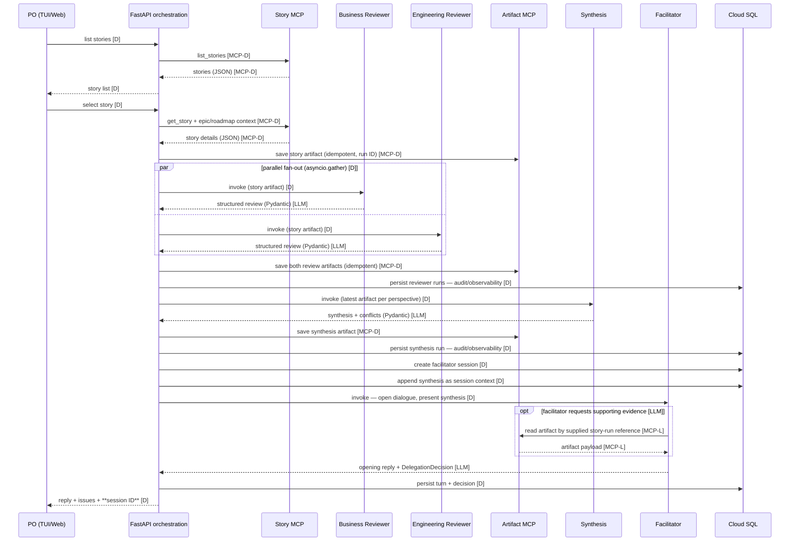

# Data Flow

Flows between UI, orchestration, agents, and MCP servers. Diagrams in Mermaid;
each is accompanied by a PlantUML-generated ASCII sequence diagram (sources in
`diagrams/`, regenerate with `plantuml -ttxt <flow>.puml`).
Legend: **[D]** = deterministic (plain Python, no LLM), **[LLM]** = LLM-driven call,
**[MCP-L]** = MCP call made by an agent (LLM-decided), **[MCP-D]** = direct MCP call
from orchestration code.

> **Design note**: all explicit invocations of the separately deployed agents come from
> the **orchestration layer** (application layer), not from agent-to-agent calls — a
> deliberate, defensible design keeping agents decoupled and independently testable
> (see `../decisions/pattern-decisions.md`).

## 1. Initial flow — story selection triggers full review



Constraint: the opening facilitator turn is **turn 1** and counts toward the cap of
10; it always emits `invoke` = none — the first
re-review can only be requested from turn 2 onward, inside the dialogue loop.

This is **Pattern 2**: sequential base (reviews → synthesis → facilitator) with parallel
reviewer fan-out.

Sequence diagram (ASCII):

```
                                                                                                                                                                                                ,.-^^-._
                                                                                                                                                                                               |-.____.-|
                                                                                                                                                                                               |        |
                                                                                                                                                                                               |        |
     ,--.                       ,-------.                ,--------.           ,---------.          ,---------.          ,-----------.          ,---------.             ,-----------.           |        |
     |PO|                       |FastAPI|                |StoryMCP|           |BusReview|          |EngReview|          |ArtifactMCP|          |Synthesis|             |Facilitator|           '-.____.-'
     `-+'                       `---+---'                `----+---'           `----+----'          `----+----'          `-----+-----'          `----+----'             `-----+-----'           CloudSQL
       |       list stories         |                         |                    |                    |                     |                     |                        |                     |
       |--------------------------->|                         |                    |                    |                     |                     |                        |                     |
       |                            |                         |                    |                    |                     |                     |                        |                     |
       |                            |      list_stories       |                    |                    |                     |                     |                        |                     |
       |                            |------------------------>|                    |                    |                     |                     |                        |                     |
       |                            |                         |                    |                    |                     |                     |                        |                     |
       |                            |     stories (JSON)      |                    |                    |                     |                     |                        |                     |
       |                            |<- - - - - - - - - - - - |                    |                    |                     |                     |                        |                     |
       |                            |                         |                    |                    |                     |                     |                        |                     |
       |        story list          |                         |                    |                    |                     |                     |                        |                     |
       |<- - - - - - - - - - - - - -|                         |                    |                    |                     |                     |                        |                     |
       |                            |                         |                    |                    |                     |                     |                        |                     |
       |       select story         |                         |                    |                    |                     |                     |                        |                     |
       |--------------------------->|                         |                    |                    |                     |                     |                        |                     |
       |                            |                         |                    |                    |                     |                     |                        |                     |
       |                            |get_story + epic/roadmap |                    |                    |                     |                     |                        |                     |
       |                            |------------------------>|                    |                    |                     |                     |                        |                     |
       |                            |                         |                    |                    |                     |                     |                        |                     |
       |                            |  story details (JSON)   |                    |                    |                     |                     |                        |                     |
       |                            |<- - - - - - - - - - - - |                    |                    |                     |                     |                        |                     |
       |                            |                         |                    |                    |                     |                     |                        |                     |
       |                            |                        save story artifact (idempotent, run ID)   |                     |                     |                        |                     |
       |                            |---------------------------------------------------------------------------------------->|                     |                        |                     |
       |                            |                         |                    |                    |                     |                     |                        |                     |
       |                            |                         |                    |                    |                     |                     |                        |                     |
       |              _________________________________________________________________________________________________       |                     |                        |                     |
       |              ! PAR  /  parallel fan-out (asyncio.gather)                  |                    |              !      |                     |                        |                     |
       |              !_____/       |                         |                    |                    |              !      |                     |                        |                     |
       |              !             |           invoke (story artifact)            |                    |              !      |                     |                        |                     |
       |              !             |--------------------------------------------->|                    |              !      |                     |                        |                     |
       |              !             |                         |                    |                    |              !      |                     |                        |                     |
       |              !             |              review (Pydantic)               |                    |              !      |                     |                        |                     |
       |              !             |<- - - - - - - - - - - - - - - - - - - - - - -|                    |              !      |                     |                        |                     |
       |              !~~~~~~~~~~~~~~~~~~~~~~~~~~~~~~~~~~~~~~~~~~~~~~~~~~~~~~~~~~~~~~~~~~~~~~~~~~~~~~~~~~~~~~~~~~~~~~~~!      |                     |                        |                     |
       |              !             |                         |                    |                    |              !      |                     |                        |                     |
       |              !             |                     invoke (story artifact)  |                    |              !      |                     |                        |                     |
       |              !             |------------------------------------------------------------------>|              !      |                     |                        |                     |
       |              !             |                         |                    |                    |              !      |                     |                        |                     |
       |              !             |                        review (Pydantic)     |                    |              !      |                     |                        |                     |
       |              !             |<- - - - - - - - - - - - - - - - - - - - - - - - - - - - - - - - - |              !      |                     |                        |                     |
       |              !~~~~~~~~~~~~~~~~~~~~~~~~~~~~~~~~~~~~~~~~~~~~~~~~~~~~~~~~~~~~~~~~~~~~~~~~~~~~~~~~~~~~~~~~~~~~~~~~!      |                     |                        |                     |
       |                            |                         |                    |                    |                     |                     |                        |                     |
       |                            |                        save both review artifacts (idempotent)    |                     |                     |                        |                     |
       |                            |---------------------------------------------------------------------------------------->|                     |                        |                     |
       |                            |                         |                    |                    |                     |                     |                        |                     |
       |                            |                         |                    |                 persist reviewer runs (audit)                  |                        |                     |
       |                            |------------------------------------------------------------------------------------------------------------------------------------------------------------->|
       |                            |                         |                    |                    |                     |                     |                        |                     |
       |                            |                         |             invoke (latest per perspective)                   |                     |                        |                     |
       |                            |-------------------------------------------------------------------------------------------------------------->|                        |                     |
       |                            |                         |                    |                    |                     |                     |                        |                     |
       |                            |                         |                  synthesis + conflicts  |                     |                     |                        |                     |
       |                            |<- - - - - - - - - - - - - - - - - - - - - - - - - - - - - - - - - - - - - - - - - - - - - - - - - - - - - - - |                        |                     |
       |                            |                         |                    |                    |                     |                     |                        |                     |
       |                            |                         |      save synthesis artifact            |                     |                     |                        |                     |
       |                            |---------------------------------------------------------------------------------------->|                     |                        |                     |
       |                            |                         |                    |                    |                     |                     |                        |                     |
       |                            |                         |                    |                 persist synthesis run (audit)                  |                        |                     |
       |                            |------------------------------------------------------------------------------------------------------------------------------------------------------------->|
       |                            |                         |                    |                    |                     |                     |                        |                     |
       |                            |                         |                    |                  create facilitator session                    |                        |                     |
       |                            |------------------------------------------------------------------------------------------------------------------------------------------------------------->|
       |                            |                         |                    |                    |                     |                     |                        |                     |
       |                            |                         |                    |                   append synthesis context                     |                        |                     |
       |                            |------------------------------------------------------------------------------------------------------------------------------------------------------------->|
       |                            |                         |                    |                    |                     |                     |                        |                     |
       |                            |                         |                    |invoke (open dialogue, present synthesis) |                     |                        |                     |
       |                            |--------------------------------------------------------------------------------------------------------------------------------------->|                     |
       |                            |                         |                    |                    |                     |                     |                        |                     |
       |                            |                         |                    |                    |                     |                     |                        |                     |
       |                            |                         |                    |                    |     _______________________________________________________________________________      |
       |                            |                         |                    |                    |     ! OPT  /  facilitator requests supporting evidence             |               !     |
       |                            |                         |                    |                    |     !_____/         |                     |                        |               !     |
       |                            |                         |                    |                    |     !               |read artifact by supplied story-run reference |               !     |
       |                            |                         |                    |                    |     !               |<---------------------------------------------|               !     |
       |                            |                         |                    |                    |     !               |                     |                        |               !     |
       |                            |                         |                    |                    |     !               |              artifact payload                |               !     |
       |                            |                         |                    |                    |     !               | - - - - - - - - - - - - - - - - - - - - - - >|               !     |
       |                            |                         |                    |                    |     !~~~~~~~~~~~~~~~~~~~~~~~~~~~~~~~~~~~~~~~~~~~~~~~~~~~~~~~~~~~~~~~~~~~~~~~~~~~~~~!     |
       |                            |                         |                    |                    |                     |                     |                        |                     |
       |                            |                         |                    |   opening reply + DelegationDecision     |                     |                        |                     |
       |                            |<- - - - - - - - - - - - - - - - - - - - - - - - - - - - - - - - - - - - - - - - - - - - - - - - - - - - - - - - - - - - - - - - - - - -|                     |
       |                            |                         |                    |                    |                     |                     |                        |                     |
       |                            |                         |                    |                    persist turn + decision                     |                        |                     |
       |                            |------------------------------------------------------------------------------------------------------------------------------------------------------------->|
       |                            |                         |                    |                    |                     |                     |                        |                     |
       |reply + issues + session ID |                         |                    |                    |                     |                     |                        |                     |
       |<- - - - - - - - - - - - - -|                         |                    |                    |                     |                     |                        |                     |
     ,-+.                       ,---+---.                ,----+---.           ,----+----.          ,----+----.          ,-----+-----.          ,----+----.             ,-----+-----.           CloudSQL
     |PO|                       |FastAPI|                |StoryMCP|           |BusReview|          |EngReview|          |ArtifactMCP|          |Synthesis|             |Facilitator|            ,.-^^-._
     `--'                       `-------'                `--------'           `---------'          `---------'          `-----------'          `---------'             `-----------'           |-.____.-|
                                                                                                                                                                                               |        |
                                                                                                                                                                                               |        |
                                                                                                                                                                                               |        |
                                                                                                                                                                                               '-.____.-'
```

## 2. Dialogue loop — facilitator, PO and LLM-driven delegation

Turn semantics: **one PO message = one request**. The turn takes a **lease-based lock**
on the session (TTL 6 min, released before the response; a crashed holder expires with
the lease — no permanently busy sessions). Concurrent messages on a locked session are
rejected. The request has a hard **end-to-end deadline of 5 min**, including final report
generation when the turn finalizes. Per-call timeouts and retry counts are maxima:
orchestration clamps each attempt to the remaining deadline and keeps a response-cleanup
reserve, so it never starts a retry that cannot fit. The 120 s timeout applies only to a
single facilitator LLM attempt. Input assembly is deterministic: FastAPI fetches story
and latest artifacts (scoped to the **session lineage** of this story run — never a
global "latest") via the Artifact MCP before invoking any agent. The facilitator may
also use its Artifact MCP tool for LLM-decided supporting-evidence reads; references are
supplied and lineage-scoped by orchestration. A retry received while the session is
`finalizing` atomically reacquires the session turn lock and resumes flow 3 directly
instead of starting another facilitator turn. If the prior response was lost after the
session became `completed`, the same idempotent endpoint returns the persisted report
reference with a newly generated signed URL; it performs no writes or rendering.

```mermaid
sequenceDiagram
    participant PO as PO (TUI/Web)
    participant F as FastAPI orchestration
    participant C as Cloud SQL
    participant A as Artifact MCP
    participant T as Facilitator
    participant B as Business Reviewer
    participant E as Engineering Reviewer
    participant Y as Synthesis

    loop while session active (max 10 facilitator turns)
        PO->>F: message (session ID, po_accepted) [D]
        F->>C: resume session + turn lock (lease TTL 6 min) [D]
        C-->>F: session + artifact references [D]
        F->>A: fetch story + latest artifacts per perspective (session lineage) [MCP-D]
        A-->>F: artifacts (payloads) [MCP-D]
        alt po_accepted = true
            F->>C: persist explicit acceptance + outcome = finalize [D]
            Note over F: skip facilitator and delegated work
        else dialogue turn
            F->>T: invoke facilitator (session context) [D]
            opt facilitator requests supporting evidence [LLM]
                T->>A: read artifact by supplied session-lineage reference [MCP-L]
                A-->>T: artifact payload [MCP-L]
            end
            T-->>F: reply + structured DelegationDecision [LLM]
            F->>C: persist turn + decision [D]
            alt invoke = both reviewers
                par parallel fan-out (asyncio.gather) [D]
                    F->>B: invoke (story + prev + extra_context) [D]
                    B-->>F: review (fresh single-turn) [LLM]
                and
                    F->>E: invoke (story + prev + extra_context) [D]
                    E-->>F: review (fresh single-turn) [LLM]
                end
                F->>A: save review artifacts (idempotent) [MCP-D]
                F->>C: persist reviewer run records — audit/observability [D]
            else invoke = business
                F->>B: invoke (story + prev + extra_context) [D]
                B-->>F: review (fresh single-turn) [LLM]
                F->>A: save review artifact (idempotent) [MCP-D]
                F->>C: persist business reviewer run — audit/observability [D]
            else invoke = engineering
                F->>E: invoke (story + prev + extra_context) [D]
                E-->>F: review (fresh single-turn) [LLM]
                F->>A: save review artifact (idempotent) [MCP-D]
                F->>C: persist engineering reviewer run — audit/observability [D]
            else reuse_previous = true
                Note over F: re-synthesis only, no reviewer run
            else invoke = none
                Note over F: dialogue only — no reviewer run or artifact write
            end
            opt new artifacts exist or reuse_previous = true
                F->>A: fetch latest per perspective — pairing constructed here [MCP-D]
                F->>Y: invoke synthesis (latest per perspective) [D]
                Y-->>F: synthesis report [LLM]
                F->>A: save synthesis artifact (idempotent) [MCP-D]
                F->>C: persist synthesis run — audit/observability [D]
                F->>C: append synthesis to session context (deterministic, not optional) [D]
            end
            alt facilitator turn 10 reached
                F->>C: session -> parked + outcome = park [D]
            else synthesis produced this turn
                F->>C: persist outcome = continue [D]
                Note over F: facilitator evaluates the new synthesis next turn
            else open_issues empty AND invoke = none
                F->>C: persist outcome = finalize [D]
            else unresolved issues remain
                F->>C: persist outcome = continue [D]
            end
        end
        alt outcome = finalize
            Note over F: continue synchronously to flow 3; no response yet
        else outcome = park
            F->>C: release turn lock [D]
            F-->>PO: reply + latest synthesis + park outcome (single response) [D]
        else outcome = continue
            F->>C: release turn lock [D]
            F-->>PO: reply + latest/updated synthesis + continue outcome (single response) [D]
        end
    end
```

Gate precedence (evaluated **before** the response is sent):

1. `finalize` immediately when `po_accepted` is set by an **explicit client action**
   (UI button/API field), never by the LLM. Facilitator and delegated work are skipped.
2. `park` when facilitator turn 10 is reached; the session becomes read-only and no
   readiness evaluation occurs on that turn.
3. `continue` whenever a synthesis was produced during the turn. The facilitator must
   evaluate that new synthesis on the next turn, preventing finalization from stale
   `open_issues`.
4. Otherwise, `finalize` when `open_issues` is empty and `invoke` = none; else `continue`.

On `finalize`, orchestration continues directly into flow 3 while retaining the turn
lock. Flow 3 first persists the deterministic `finalized-review` artifact (latest
synthesis + dialogue resolutions + PO acceptance state), renders every format in the
session's `requested_formats` from that artifact, releases the lock, and sends the
request's only response. On `continue` or
`park`, flow 2 releases the lock and sends the request's only response.

Pattern mapping of this flow:

- **Pattern 1**: separately deployed agents invoked explicitly (Agent Engine client
  SDK, from the orchestration layer — see design note above), in sequence, inside a loop.
- **Pattern 3**: the facilitator's DelegationDecision is LLM-driven delegation inside a
  User-in-the-Loop conversation; reviewer → synthesis is the simple sequential chain
  invoked from the hierarchy.

Synthesis is invoked **at most once per turn**, only when new artifacts exist or
`reuse_previous` = true. Updated synthesis is **always** appended to the session context.
A turn that produces synthesis cannot finalize; the facilitator evaluates that synthesis
on the next turn.

Sequence diagram (ASCII):

```
                                                                                                                                                         ,.-^^-._
                                                                                                                                                        |-.____.-|
                                                                                                                                                        |        |
                                                                                                                                                        |        |
                              ,--.                                                                 ,-------.                                            |        |          ,-----------.                                        ,-----------.          ,---------.          ,---------.          ,---------.
                              |PO|                                                                 |FastAPI|                                            '-.____.-'          |ArtifactMCP|                                        |Facilitator|          |BusReview|          |EngReview|          |Synthesis|
                              `-+'                                                                 `---+---'                                            CloudSQL            `-----+-----'                                        `-----+-----'          `----+----'          `----+----'          `----+----'
                                |                                                                      |                                                    |                     |                                                    |                     |                    |                    |
          ________________________________________________________________________________________________________________________________________________________________________________________________________________________________________________________________________________________________________________________________
          ! LOOP  /  while session active (max 10 facilitator turns)                                   |                                                    |                     |                                                    |                     |                    |                    |                                  !
          !______/              |                                                                      |                                                    |                     |                                                    |                     |                    |                    |                                  !
          !                     |                  message (session ID, po_accepted)                   |                                                    |                     |                                                    |                     |                    |                    |                                  !
          !                     |--------------------------------------------------------------------->|                                                    |                     |                                                    |                     |                    |                    |                                  !
          !                     |                                                                      |                                                    |                     |                                                    |                     |                    |                    |                                  !
          !                     |                                                                      |   resume session + turn lock (lease TTL 6 min)     |                     |                                                    |                     |                    |                    |                                  !
          !                     |                                                                      |--------------------------------------------------->|                     |                                                    |                     |                    |                    |                                  !
          !                     |                                                                      |                                                    |                     |                                                    |                     |                    |                    |                                  !
          !                     |                                                                      |           session + artifact references            |                     |                                                    |                     |                    |                    |                                  !
          !                     |                                                                      |<- - - - - - - - - - - - - - - - - - - - - - - - - -|                     |                                                    |                     |                    |                    |                                  !
          !                     |                                                                      |                                                    |                     |                                                    |                     |                    |                    |                                  !
          !                     |                                                                      |    fetch story + latest artifacts per perspective (session lineage)      |                                                    |                     |                    |                    |                                  !
          !                     |                                                                      |------------------------------------------------------------------------->|                                                    |                     |                    |                    |                                  !
          !                     |                                                                      |                                                    |                     |                                                    |                     |                    |                    |                                  !
          !                     |                                                                      |                          artifacts (payloads)      |                     |                                                    |                     |                    |                    |                                  !
          !                     |                                                                      |<- - - - - - - - - - - - - - - - - - - - - - - - - - - - - - - - - - - - -|                                                    |                     |                    |                    |                                  !
          !                     |                                                                      |                                                    |                     |                                                    |                     |                    |                    |                                  !
          !                     |                                                                      |                                                    |                     |                                                    |                     |                    |                    |                                  !
          !                     |                            ___________________________________________________________________________________________________________________________________________________________________________________________________________________________________________________________________          !
          !                     |                            ! ALT  /  po_accepted = true              |                                                    |                     |                                                    |                     |                    |                    |                        !         !
          !                     |                            !_____/                                   |                                                    |                     |                                                    |                     |                    |                    |                        !         !
          !                     |                            !                                         | persist explicit acceptance + outcome = finalize   |                     |                                                    |                     |                    |                    |                        !         !
          !                     |                            !                                         |--------------------------------------------------->|                     |                                                    |                     |                    |                    |                        !         !
          !                     |                            !                                         |                                                    |                     |                                                    |                     |                    |                    |                        !         !
          !                     |                            !                      ,-----------------------------------!.                                  |                     |                                                    |                     |                    |                    |                        !         !
          !                     |                            !                      |skip facilitator and delegated work|_\                                 |                     |                                                    |                     |                    |                    |                        !         !
          !                     |                            !~~~~~~~~~~~~~~~~~~~~~~~~~~~~~~~~~~~~~~~~~~~~~~~~~~~~~~~~~~~~~~~~~~~~~~~~~~~~~~~~~~~~~~~~~~~~~~~~~~~~~~~~~~~~~~~~~~~~~~~~~~~~~~~~~~~~~~~~~~~~~~~~~~~~~~~~~~~~~~~~~~~~~~~~~~~~~~~~~~~~~~~~~~~~~~~~~~~~~~~~~~~~~~~~~~~~~~~~~~~~~~~~~~~~~~~~~~~~~~~~~~~~~~~~~~~~~~~~~~!         !
          !                     |                            ! [dialogue turn]                         |                                                    |                     |                                                    |                     |                    |                    |                        !         !
          !                     |                            !                                         |                                                   invoke (session context)                                                    |                     |                    |                    |                        !         !
          !                     |                            !                                         |------------------------------------------------------------------------------------------------------------------------------>|                     |                    |                    |                        !         !
          !                     |                            !                                         |                                                    |                     |                                                    |                     |                    |                    |                        !         !
          !                     |                            !                                         |                                                    |                     |                                                    |                     |                    |                    |                        !         !
          !                     |                            !                                         |                                                    |     _____________________________________________________________________________________      |                    |                    |                        !         !
          !                     |                            !                                         |                                                    |     ! OPT  /  facilitator requests supporting evidence                   |               !     |                    |                    |                        !         !
          !                     |                            !                                         |                                                    |     !_____/         |                                                    |               !     |                    |                    |                        !         !
          !                     |                            !                                         |                                                    |     !               |read artifact by supplied session-lineage reference |               !     |                    |                    |                        !         !
          !                     |                            !                                         |                                                    |     !               |<---------------------------------------------------|               !     |                    |                    |                        !         !
          !                     |                            !                                         |                                                    |     !               |                                                    |               !     |                    |                    |                        !         !
          !                     |                            !                                         |                                                    |     !               |                 artifact payload                   |               !     |                    |                    |                        !         !
          !                     |                            !                                         |                                                    |     !               | - - - - - - - - - - - - - - - - - - - - - - - - - >|               !     |                    |                    |                        !         !
          !                     |                            !                                         |                                                    |     !~~~~~~~~~~~~~~~~~~~~~~~~~~~~~~~~~~~~~~~~~~~~~~~~~~~~~~~~~~~~~~~~~~~~~~~~~~~~~~~~~~~~!     |                    |                    |                        !         !
          !                     |                            !                                         |                                                    |                     |                                                    |                     |                    |                    |                        !         !
          !                     |                            !                                         |                                                  reply + DelegationDecision                                                   |                     |                    |                    |                        !         !
          !                     |                            !                                         |<- - - - - - - - - - - - - - - - - - - - - - - - - - - - - - - - - - - - - - - - - - - - - - - - - - - - - - - - - - - - - - - |                     |                    |                    |                        !         !
          !                     |                            !                                         |                                                    |                     |                                                    |                     |                    |                    |                        !         !
          !                     |                            !                                         |              persist turn + decision               |                     |                                                    |                     |                    |                    |                        !         !
          !                     |                            !                                         |--------------------------------------------------->|                     |                                                    |                     |                    |                    |                        !         !
          !                     |                            !                                         |                                                    |                     |                                                    |                     |                    |                    |                        !         !
          !                     |                            !                                         |                                                    |                     |                                                    |                     |                    |                    |                        !         !
          !                     |                            !         ____________________________________________________________________________________________________________________________________________________________________________________________________________________________________                     !         !
          !                     |                            !         ! ALT  /  invoke = both reviewers                                                    |                     |                                                    |                     |                    |                    |   !                    !         !
          !                     |                            !         !_____/                         |                                                    |                     |                                                    |                     |                    |                    |   !                    !         !
          !                     |                            !         !                               |                                                    |                     |                                                    |                     |                    |                    |   !                    !         !
          !                     |                            !         !                 ________________________________________________________________________________________________________________________________________________________________________________________________________      |   !                    !         !
          !                     |                            !         !                 ! PAR  /  parallel fan-out (asyncio.gather)                        |                     |                                                    |                     |                    |              !     |   !                    !         !
          !                     |                            !         !                 !_____/       |                                                    |                     |                                                    |                     |                    |              !     |   !                    !         !
          !                     |                            !         !                 !             |                                                    |  invoke (story + prev + extra_context)                                   |                     |                    |              !     |   !                    !         !
          !                     |                            !         !                 !             |---------------------------------------------------------------------------------------------------------------------------------------------------->|                    |              !     |   !                    !         !
          !                     |                            !         !                 !             |                                                    |                     |                                                    |                     |                    |              !     |   !                    !         !
          !                     |                            !         !                 !             |                                                    |                  review                                                  |                     |                    |              !     |   !                    !         !
          !                     |                            !         !                 !             |<- - - - - - - - - - - - - - - - - - - - - - - - - - - - - - - - - - - - - - - - - - - - - - - - - - - - - - - - - - - - - - - - - - - - - - - - - - |                    |              !     |   !                    !         !
          !                     |                            !         !                 !~~~~~~~~~~~~~~~~~~~~~~~~~~~~~~~~~~~~~~~~~~~~~~~~~~~~~~~~~~~~~~~~~~~~~~~~~~~~~~~~~~~~~~~~~~~~~~~~~~~~~~~~~~~~~~~~~~~~~~~~~~~~~~~~~~~~~~~~~~~~~~~~~~~~~~~~~~~~~~~~~~~~~~~~~~~~~~~~~~~~~~~~~~~~~~~~~~~~~~~!     |   !                    !         !
          !                     |                            !         !                 !             |                                                    |                     |                                                    |                     |                    |              !     |   !                    !         !
          !                     |                            !         !                 !             |                                                    |             invoke (story + prev + extra_context)                        |                     |                    |              !     |   !                    !         !
          !                     |                            !         !                 !             |------------------------------------------------------------------------------------------------------------------------------------------------------------------------->|              !     |   !                    !         !
          !                     |                            !         !                 !             |                                                    |                     |                                                    |                     |                    |              !     |   !                    !         !
          !                     |                            !         !                 !             |                                                    |                     |      review                                        |                     |                    |              !     |   !                    !         !
          !                     |                            !         !                 !             |<- - - - - - - - - - - - - - - - - - - - - - - - - - - - - - - - - - - - - - - - - - - - - - - - - - - - - - - - - - - - - - - - - - - - - - - - - - - - - - - - - - - - -|              !     |   !                    !         !
          !                     |                            !         !                 !~~~~~~~~~~~~~~~~~~~~~~~~~~~~~~~~~~~~~~~~~~~~~~~~~~~~~~~~~~~~~~~~~~~~~~~~~~~~~~~~~~~~~~~~~~~~~~~~~~~~~~~~~~~~~~~~~~~~~~~~~~~~~~~~~~~~~~~~~~~~~~~~~~~~~~~~~~~~~~~~~~~~~~~~~~~~~~~~~~~~~~~~~~~~~~~~~~~~~~~!     |   !                    !         !
          !                     |                            !         !                               |                                                    |                     |                                                    |                     |                    |                    |   !                    !         !
          !                     |                            !         !                               |                   save review artifacts (idempotent)                     |                                                    |                     |                    |                    |   !                    !         !
          !                     |                            !         !                               |------------------------------------------------------------------------->|                                                    |                     |                    |                    |   !                    !         !
          !                     |                            !         !                               |                                                    |                     |                                                    |                     |                    |                    |   !                    !         !
          !                     |                            !         !                               |       persist reviewer run records (audit)         |                     |                                                    |                     |                    |                    |   !                    !         !
          !                     |                            !         !                               |--------------------------------------------------->|                     |                                                    |                     |                    |                    |   !                    !         !
          !                     |                            !         !~~~~~~~~~~~~~~~~~~~~~~~~~~~~~~~~~~~~~~~~~~~~~~~~~~~~~~~~~~~~~~~~~~~~~~~~~~~~~~~~~~~~~~~~~~~~~~~~~~~~~~~~~~~~~~~~~~~~~~~~~~~~~~~~~~~~~~~~~~~~~~~~~~~~~~~~~~~~~~~~~~~~~~~~~~~~~~~~~~~~~~~~~~~~~~~~~~~~~~~~~~~~~~~~~~~~~~~~~~~~~~~~~~~!                    !         !
          !                     |                            !         ! [invoke = business]           |                                                    |                     |                                                    |                     |                    |                    |   !                    !         !
          !                     |                            !         !                               |                                                    |  invoke (story + prev + extra_context)                                   |                     |                    |                    |   !                    !         !
          !                     |                            !         !                               |---------------------------------------------------------------------------------------------------------------------------------------------------->|                    |                    |   !                    !         !
          !                     |                            !         !                               |                                                    |                     |                                                    |                     |                    |                    |   !                    !         !
          !                     |                            !         !                               |                                                    |                  review                                                  |                     |                    |                    |   !                    !         !
          !                     |                            !         !                               |<- - - - - - - - - - - - - - - - - - - - - - - - - - - - - - - - - - - - - - - - - - - - - - - - - - - - - - - - - - - - - - - - - - - - - - - - - - |                    |                    |   !                    !         !
          !                     |                            !         !                               |                                                    |                     |                                                    |                     |                    |                    |   !                    !         !
          !                     |                            !         !                               |                    save review artifact (idempotent)                     |                                                    |                     |                    |                    |   !                    !         !
          !                     |                            !         !                               |------------------------------------------------------------------------->|                                                    |                     |                    |                    |   !                    !         !
          !                     |                            !         !                               |                                                    |                     |                                                    |                     |                    |                    |   !                    !         !
          !                     |                            !         !                               |       persist business reviewer run (audit)        |                     |                                                    |                     |                    |                    |   !                    !         !
          !                     |                            !         !                               |--------------------------------------------------->|                     |                                                    |                     |                    |                    |   !                    !         !
          !                     |                            !         !~~~~~~~~~~~~~~~~~~~~~~~~~~~~~~~~~~~~~~~~~~~~~~~~~~~~~~~~~~~~~~~~~~~~~~~~~~~~~~~~~~~~~~~~~~~~~~~~~~~~~~~~~~~~~~~~~~~~~~~~~~~~~~~~~~~~~~~~~~~~~~~~~~~~~~~~~~~~~~~~~~~~~~~~~~~~~~~~~~~~~~~~~~~~~~~~~~~~~~~~~~~~~~~~~~~~~~~~~~~~~~~~~~~!                    !         !
          !                     |                            !         ! [invoke = engineering]        |                                                    |                     |                                                    |                     |                    |                    |   !                    !         !
          !                     |                            !         !                               |                                                    |             invoke (story + prev + extra_context)                        |                     |                    |                    |   !                    !         !
          !                     |                            !         !                               |------------------------------------------------------------------------------------------------------------------------------------------------------------------------->|                    |   !                    !         !
          !                     |                            !         !                               |                                                    |                     |                                                    |                     |                    |                    |   !                    !         !
          !                     |                            !         !                               |                                                    |                     |      review                                        |                     |                    |                    |   !                    !         !
          !                     |                            !         !                               |<- - - - - - - - - - - - - - - - - - - - - - - - - - - - - - - - - - - - - - - - - - - - - - - - - - - - - - - - - - - - - - - - - - - - - - - - - - - - - - - - - - - - -|                    |   !                    !         !
          !                     |                            !         !                               |                                                    |                     |                                                    |                     |                    |                    |   !                    !         !
          !                     |                            !         !                               |                    save review artifact (idempotent)                     |                                                    |                     |                    |                    |   !                    !         !
          !                     |                            !         !                               |------------------------------------------------------------------------->|                                                    |                     |                    |                    |   !                    !         !
          !                     |                            !         !                               |                                                    |                     |                                                    |                     |                    |                    |   !                    !         !
          !                     |                            !         !                               |     persist engineering reviewer run (audit)       |                     |                                                    |                     |                    |                    |   !                    !         !
          !                     |                            !         !                               |--------------------------------------------------->|                     |                                                    |                     |                    |                    |   !                    !         !
          !                     |                            !         !~~~~~~~~~~~~~~~~~~~~~~~~~~~~~~~~~~~~~~~~~~~~~~~~~~~~~~~~~~~~~~~~~~~~~~~~~~~~~~~~~~~~~~~~~~~~~~~~~~~~~~~~~~~~~~~~~~~~~~~~~~~~~~~~~~~~~~~~~~~~~~~~~~~~~~~~~~~~~~~~~~~~~~~~~~~~~~~~~~~~~~~~~~~~~~~~~~~~~~~~~~~~~~~~~~~~~~~~~~~~~~~~~~~!                    !         !
          !                     |                            !         ! [reuse_previous = true]       |                                                    |                     |                                                    |                     |                    |                    |   !                    !         !
          !                     |                            !         !             ,----------------------------------!.                                  |                     |                                                    |                     |                    |                    |   !                    !         !
          !                     |                            !         !             |re-synthesis only; no reviewer run|_\                                 |                     |                                                    |                     |                    |                    |   !                    !         !
          !                     |                            !         !~~~~~~~~~~~~~~~~~~~~~~~~~~~~~~~~~~~~~~~~~~~~~~~~~~~~~~~~~~~~~~~~~~~~~~~~~~~~~~~~~~~~~~~~~~~~~~~~~~~~~~~~~~~~~~~~~~~~~~~~~~~~~~~~~~~~~~~~~~~~~~~~~~~~~~~~~~~~~~~~~~~~~~~~~~~~~~~~~~~~~~~~~~~~~~~~~~~~~~~~~~~~~~~~~~~~~~~~~~~~~~~~~~~!                    !         !
          !                     |                            !         ! [invoke = none]               |                                                    |                     |                                                    |                     |                    |                    |   !                    !         !
          !                     |                            !         !      ,------------------------------------------------!.                           |                     |                                                    |                     |                    |                    |   !                    !         !
          !                     |                            !         !      |dialogue only; no reviewer run or artifact write|_\                          |                     |                                                    |                     |                    |                    |   !                    !         !
          !                     |                            !         !~~~~~~`--------------------------------------------------'~~~~~~~~~~~~~~~~~~~~~~~~~~~~~~~~~~~~~~~~~~~~~~~~~~~~~~~~~~~~~~~~~~~~~~~~~~~~~~~~~~~~~~~~~~~~~~~~~~~~~~~~~~~~~~~~~~~~~~~~~~~~~~~~~~~~~~~~~~~~~~~~~~~~~~~~~~~~~~~~~~~~~~~~~!                    !         !
          !                     |                            !                                         |                                                    |                     |                                                    |                     |                    |                    |                        !         !
          !                     |                            !                                         |                                                    |                     |                                                    |                     |                    |                    |                        !         !
          !                     |                            !                           _____________________________________________________________________________________________________________________________________________________________________________________________________________________________          !         !
          !                     |                            !                           ! OPT  /  new artifacts exist or reuse_previous                    |                     |                                                    |                     |                    |                    |              !         !         !
          !                     |                            !                           !_____/       |                                                    |                     |                                                    |                     |                    |                    |              !         !         !
          !                     |                            !                           !             |            fetch latest per perspective (pairing done here)              |                                                    |                     |                    |                    |              !         !         !
          !                     |                            !                           !             |------------------------------------------------------------------------->|                                                    |                     |                    |                    |              !         !         !
          !                     |                            !                           !             |                                                    |                     |                                                    |                     |                    |                    |              !         !         !
          !                     |                            !                           !             |                                                    |                     invoke synthesis (latest per perspective)            |                     |                    |                    |              !         !         !
          !                     |                            !                           !             |---------------------------------------------------------------------------------------------------------------------------------------------------------------------------------------------->|              !         !         !
          !                     |                            !                           !             |                                                    |                     |                                                    |                     |                    |                    |              !         !         !
          !                     |                            !                           !             |                                                    |                     |            synthesis report                        |                     |                    |                    |              !         !         !
          !                     |                            !                           !             |<- - - - - - - - - - - - - - - - - - - - - - - - - - - - - - - - - - - - - - - - - - - - - - - - - - - - - - - - - - - - - - - - - - - - - - - - - - - - - - - - - - - - - - - - - - - - - - - |              !         !         !
          !                     |                            !                           !             |                                                    |                     |                                                    |                     |                    |                    |              !         !         !
          !                     |                            !                           !             |                  save synthesis artifact (idempotent)                    |                                                    |                     |                    |                    |              !         !         !
          !                     |                            !                           !             |------------------------------------------------------------------------->|                                                    |                     |                    |                    |              !         !         !
          !                     |                            !                           !             |                                                    |                     |                                                    |                     |                    |                    |              !         !         !
          !                     |                            !                           !             |           persist synthesis run (audit)            |                     |                                                    |                     |                    |                    |              !         !         !
          !                     |                            !                           !             |--------------------------------------------------->|                     |                                                    |                     |                    |                    |              !         !         !
          !                     |                            !                           !             |                                                    |                     |                                                    |                     |                    |                    |              !         !         !
          !                     |                            !                           !             |append synthesis to session context (deterministic) |                     |                                                    |                     |                    |                    |              !         !         !
          !                     |                            !                           !             |--------------------------------------------------->|                     |                                                    |                     |                    |                    |              !         !         !
          !                     |                            !                           !~~~~~~~~~~~~~~~~~~~~~~~~~~~~~~~~~~~~~~~~~~~~~~~~~~~~~~~~~~~~~~~~~~~~~~~~~~~~~~~~~~~~~~~~~~~~~~~~~~~~~~~~~~~~~~~~~~~~~~~~~~~~~~~~~~~~~~~~~~~~~~~~~~~~~~~~~~~~~~~~~~~~~~~~~~~~~~~~~~~~~~~~~~~~~~~~~~~~~~~~~~~~~~~~~~~~~~~~~~~~!         !         !
          !                     |                            !                                         |                                                    |                     |                                                    |                     |                    |                    |                        !         !
          !                     |                            !                                         |                                                    |                     |                                                    |                     |                    |                    |                        !         !
          !                     |                            !          ___________________________________________________________________________________________________       |                                                    |                     |                    |                    |                        !         !
          !                     |                            !          ! ALT  /  facilitator turn 10 reached                                               |              !      |                                                    |                     |                    |                    |                        !         !
          !                     |                            !          !_____/                        |                                                    |              !      |                                                    |                     |                    |                    |                        !         !
          !                     |                            !          !                              |        session -> parked + outcome = park          |              !      |                                                    |                     |                    |                    |                        !         !
          !                     |                            !          !                              |--------------------------------------------------->|              !      |                                                    |                     |                    |                    |                        !         !
          !                     |                            !          !~~~~~~~~~~~~~~~~~~~~~~~~~~~~~~~~~~~~~~~~~~~~~~~~~~~~~~~~~~~~~~~~~~~~~~~~~~~~~~~~~~~~~~~~~~~~~~~~~~!      |                                                    |                     |                    |                    |                        !         !
          !                     |                            !          ! [synthesis produced this turn]                                                    |              !      |                                                    |                     |                    |                    |                        !         !
          !                     |                            !          !                              |            persist outcome = continue              |              !      |                                                    |                     |                    |                    |                        !         !
          !                     |                            !          !                              |--------------------------------------------------->|              !      |                                                    |                     |                    |                    |                        !         !
          !                     |                            !          !                              |                                                    |              !      |                                                    |                     |                    |                    |                        !         !
          !                     |                            !          !      ,---------------------------------------------!.                             |              !      |                                                    |                     |                    |                    |                        !         !
          !                     |                            !          !      |facilitator evaluates new synthesis next turn|_\                            |              !      |                                                    |                     |                    |                    |                        !         !
          !                     |                            !          !~~~~~~~~~~~~~~~~~~~~~~~~~~~~~~~~~~~~~~~~~~~~~~~~~~~~~~~~~~~~~~~~~~~~~~~~~~~~~~~~~~~~~~~~~~~~~~~~~~!      |                                                    |                     |                    |                    |                        !         !
          !                     |                            !          ! [open_issues empty AND invoke = none]                                             |              !      |                                                    |                     |                    |                    |                        !         !
          !                     |                            !          !                              |            persist outcome = finalize              |              !      |                                                    |                     |                    |                    |                        !         !
          !                     |                            !          !                              |--------------------------------------------------->|              !      |                                                    |                     |                    |                    |                        !         !
          !                     |                            !          !~~~~~~~~~~~~~~~~~~~~~~~~~~~~~~~~~~~~~~~~~~~~~~~~~~~~~~~~~~~~~~~~~~~~~~~~~~~~~~~~~~~~~~~~~~~~~~~~~~!      |                                                    |                     |                    |                    |                        !         !
          !                     |                            !          ! [unresolved issues remain]   |                                                    |              !      |                                                    |                     |                    |                    |                        !         !
          !                     |                            !          !                              |            persist outcome = continue              |              !      |                                                    |                     |                    |                    |                        !         !
          !                     |                            !          !                              |--------------------------------------------------->|              !      |                                                    |                     |                    |                    |                        !         !
          !                     |                            !          !~~~~~~~~~~~~~~~~~~~~~~~~~~~~~~~~~~~~~~~~~~~~~~~~~~~~~~~~~~~~~~~~~~~~~~~~~~~~~~~~~~~~~~~~~~~~~~~~~~!      |                                                    |                     |                    |                    |                        !         !
          !                     |                            !~~~~~~~~~~~~~~~~~~~~~~~~~~~~~~~~~~~~~~~~~~~~~~~~~~~~~~~~~~~~~~~~~~~~~~~~~~~~~~~~~~~~~~~~~~~~~~~~~~~~~~~~~~~~~~~~~~~~~~~~~~~~~~~~~~~~~~~~~~~~~~~~~~~~~~~~~~~~~~~~~~~~~~~~~~~~~~~~~~~~~~~~~~~~~~~~~~~~~~~~~~~~~~~~~~~~~~~~~~~~~~~~~~~~~~~~~~~~~~~~~~~~~~~~~~~~~~~~~~!         !
          !                     |                                                                      |                                                    |                     |                                                    |                     |                    |                    |                                  !
          !                     |                                                                      |                                                    |                     |                                                    |                     |                    |                    |                                  !
          !         _______________________________________________________________________________________________________________________________________________________       |                                                    |                     |                    |                    |                                  !
          !         ! ALT  /  outcome = finalize                                                       |                                                    |              !      |                                                    |                     |                    |                    |                                  !
          !         !_____/     |                                                                      |                                                    |              !      |                                                    |                     |                    |                    |                                  !
          !         !           |                                                   ,-----------------------------------!.                                  |              !      |                                                    |                     |                    |                    |                                  !
          !         !           |                                                   |continue to flow 3; no response yet|_\                                 |              !      |                                                    |                     |                    |                    |                                  !
          !         !~~~~~~~~~~~~~~~~~~~~~~~~~~~~~~~~~~~~~~~~~~~~~~~~~~~~~~~~~~~~~~~~~~~~~~~~~~~~~~~~~~~~~~~~~~~~~~~~~~~~~~~~~~~~~~~~~~~~~~~~~~~~~~~~~~~~~~~~~~~~~~~~~~~~~~!      |                                                    |                     |                    |                    |                                  !
          !         ! [outcome = park]                                                                 |                                                    |              !      |                                                    |                     |                    |                    |                                  !
          !         !           |                                                                      |                 release turn lock                  |              !      |                                                    |                     |                    |                    |                                  !
          !         !           |                                                                      |--------------------------------------------------->|              !      |                                                    |                     |                    |                    |                                  !
          !         !           |                                                                      |                                                    |              !      |                                                    |                     |                    |                    |                                  !
          !         !           |      reply + latest synthesis + park outcome (single response)       |                                                    |              !      |                                                    |                     |                    |                    |                                  !
          !         !           |<- - - - - - - - - - - - - - - - - - - - - - - - - - - - - - - - - - -|                                                    |              !      |                                                    |                     |                    |                    |                                  !
          !         !~~~~~~~~~~~~~~~~~~~~~~~~~~~~~~~~~~~~~~~~~~~~~~~~~~~~~~~~~~~~~~~~~~~~~~~~~~~~~~~~~~~~~~~~~~~~~~~~~~~~~~~~~~~~~~~~~~~~~~~~~~~~~~~~~~~~~~~~~~~~~~~~~~~~~~!      |                                                    |                     |                    |                    |                                  !
          !         ! [outcome = continue]                                                             |                                                    |              !      |                                                    |                     |                    |                    |                                  !
          !         !           |                                                                      |                 release turn lock                  |              !      |                                                    |                     |                    |                    |                                  !
          !         !           |                                                                      |--------------------------------------------------->|              !      |                                                    |                     |                    |                    |                                  !
          !         !           |                                                                      |                                                    |              !      |                                                    |                     |                    |                    |                                  !
          !         !           |reply + latest/updated synthesis + continue outcome (single response) |                                                    |              !      |                                                    |                     |                    |                    |                                  !
          !         !           |<- - - - - - - - - - - - - - - - - - - - - - - - - - - - - - - - - - -|                                                    |              !      |                                                    |                     |                    |                    |                                  !
          !         !~~~~~~~~~~~~~~~~~~~~~~~~~~~~~~~~~~~~~~~~~~~~~~~~~~~~~~~~~~~~~~~~~~~~~~~~~~~~~~~~~~~~~~~~~~~~~~~~~~~~~~~~~~~~~~~~~~~~~~~~~~~~~~~~~~~~~~~~~~~~~~~~~~~~~~!      |                                                    |                     |                    |                    |                                  !
          !~~~~~~~~~~~~~~~~~~~~~~~~~~~~~~~~~~~~~~~~~~~~~~~~~~~~~~~~~~~~~~~~~~~~~~~~~~~~~~~~~~~~~~~~~~~~~~~~~~~~~~~~~~~~~~~~~~~~~~~~~~~~~~~~~~~~~~~~~~~~~~~~~~~~~~~~~~~~~~~~~~~~~~~~~~~~~~~~~~~~~~~~~~~~~~~~~~~~~~~~~~~~~~~~~~~~~~~~~~~~~~~~~~~~~~~~~~~~~~~~~~~~~~~~~~~~~~~~~~~~~~~~~~~~~~~~~~~~~~~~~~~~~~~~~~~~~~~~~~~~~~~~~~~~~~~~~~~~~~~!
                              ,-+.                                                                 ,---+---.                                            CloudSQL            ,-----+-----.                                        ,-----+-----.          ,----+----.          ,----+----.          ,----+----.
                              |PO|                                                                 |FastAPI|                                             ,.-^^-._           |ArtifactMCP|                                        |Facilitator|          |BusReview|          |EngReview|          |Synthesis|
                              `--'                                                                 `-------'                                            |-.____.-|          `-----------'                                        `-----------'          `---------'          `---------'          `---------'
                                                                                                                                                        |        |
                                                                                                                                                        |        |
                                                                                                                                                        |        |
                                                                                                                                                        '-.____.-'
```

## 3. Readiness — final report

Triggered synchronously by the gate outcome `finalize` from flow 2 (no second
facilitator event and no prior HTTP response), or resumed directly by a retry. The
flow-2 path retains its turn lock; a `finalizing` retry atomically acquires the same lease
and rejects a competing retry. A `completed` retry is read-only: it skips rendering and
returns the persisted report reference with a fresh signed URL. Session states are
`active`, `parked`, `finalizing`, and `completed`; the successful path is `active` →
`finalizing` → `completed`. The session is marked `completed` only **after** the
`finalized-review` artifact and every requested report artifact are saved and their
references persisted. A report failure leaves the session in
`finalizing`, releases the turn lock, and returns a structured retryable error. FastAPI
generates a signed URL from the persisted GCS artifact reference. The URL is not stored
as session state because it expires and can be regenerated.

```mermaid
sequenceDiagram
    participant PO as PO (TUI/Web)
    participant F as FastAPI orchestration
    participant C as Cloud SQL
    participant A as Artifact MCP
    participant R as Report MCP
    participant G as GCS

    alt retry a completed session or lost response
        PO->>F: retry finalization/download (session ID, idempotency key) [D]
        F->>C: load completed session + report reference [D]
        C-->>F: immutable report reference [D]
        Note over F: generate fresh signed URL; no render or write [D]
        F-->>PO: final report reference + signed URL (single response) [D]
        PO->>G: download with signed URL [D]
        G-->>PO: report bytes [D]
    else finalize active session or retry finalizing session
        alt entered from flow 2 gate
            Note over F: existing turn lock remains held
        else retry an existing finalizing session
            PO->>F: retry finalization (session ID, idempotency key) [D]
            F->>C: load finalizing session + acquire turn lock (lease TTL 6 min) [D]
            C-->>F: finalizing session + report references [D]
        end
        F->>C: session -> finalizing (idempotent) [D]
        F->>A: save finalized-review artifact (synthesis + dialogue resolutions + acceptance) [MCP-D]
        A-->>F: finalized-review reference [MCP-D]
        F->>R: render each requested format (MD/PDF) from the finalized-review artifact [MCP-D]
        alt report and download URL prepared
            R->>G: save report artifacts (one per requested format) [D]
            G-->>R: artifact metadata [D]
            R-->>F: artifact references [MCP-D]
            Note over F: generate signed URL from artifact reference [D]
            F->>C: persist report references + session -> completed [D]
            F->>C: release turn lock [D]
            F-->>PO: final report reference + signed URL (single response) [D]
            PO->>G: download with signed URL [D]
            G-->>PO: report bytes [D]
        else report or signed-URL generation fails, or deadline expires
            Note over F,R: orchestration normalizes failure as structured error
            F->>C: keep finalizing + release turn lock [D]
            F-->>PO: structured retryable error (single response) [D]
        end
    end
```

Sequence diagram (ASCII):

```
                                                                                                                                                       ,.-^^-._                                                                                                                
                                                                                                                                                      |-.____.-|                                                                                                               
                                                                                                                                                      |        |                                                                                                               
                                                                                                                                                      |        |                                                                                                               
                              ,--.                                                     ,-------.                                                      |        |          ,-----------.          ,---------.                                          ,---.                    
                              |PO|                                                     |FastAPI|                                                      '-.____.-'          |ArtifactMCP|          |ReportMCP|                                          |GCS|                    
                              `-+'                                                     `---+---'                                                      CloudSQL            `-----+-----'          `----+----'                                          `-+-'                    
                                |                                                          |                                                              |                     |                     |                                                 |                      
          ____________________________________________________________________________________________________________________________________________________________________________________________________________________________________________________________________ 
          ! ALT  /  retry a completed session or lost response                             |                                                              |                     |                     |                                                 |                     !
          !_____/               |                                                          |                                                              |                     |                     |                                                 |                     !
          !                     |retry finalization/download (session ID, idempotency key) |                                                              |                     |                     |                                                 |                     !
          !                     |--------------------------------------------------------->|                                                              |                     |                     |                                                 |                     !
          !                     |                                                          |                                                              |                     |                     |                                                 |                     !
          !                     |                                                          |          load completed session + report reference           |                     |                     |                                                 |                     !
          !                     |                                                          |------------------------------------------------------------->|                     |                     |                                                 |                     !
          !                     |                                                          |                                                              |                     |                     |                                                 |                     !
          !                     |                                                          |                 immutable report reference                   |                     |                     |                                                 |                     !
          !                     |                                                          |<- - - - - - - - - - - - - - - - - - - - - - - - - - - - - - -|                     |                     |                                                 |                     !
          !                     |                                                          |                                                              |                     |                     |                                                 |                     !
          !                     |                                  ,---------------------------------------------!.                                       |                     |                     |                                                 |                     !
          !                     |                                  |generate fresh signed URL; no render or write|_\                                      |                     |                     |                                                 |                     !
          !                     |                                  `-----------------------------------------------'                                      |                     |                     |                                                 |                     !
          !                     |  final report reference + signed URL (single response)   |                                                              |                     |                     |                                                 |                     !
          !                     |<- - - - - - - - - - - - - - - - - - - - - - - - - - - - -|                                                              |                     |                     |                                                 |                     !
          !                     |                                                          |                                                              |                     |                     |                                                 |                     !
          !                     |                                                          |                                    download with signed URL  |                     |                     |                                                 |                     !
          !                     |---------------------------------------------------------------------------------------------------------------------------------------------------------------------------------------------------------------------->|                     !
          !                     |                                                          |                                                              |                     |                     |                                                 |                     !
          !                     |                                                          |                                          report bytes        |                     |                     |                                                 |                     !
          !                     |<- - - - - - - - - - - - - - - - - - - - - - - - - - - - - - - - - - - - - - - - - - - - - - - - - - - - - - - - - - - - - - - - - - - - - - - - - - - - - - - - - - - - - - - - - - - - - - - - - - - - - - - - - - - |                     !
          !~~~~~~~~~~~~~~~~~~~~~~~~~~~~~~~~~~~~~~~~~~~~~~~~~~~~~~~~~~~~~~~~~~~~~~~~~~~~~~~~~~~~~~~~~~~~~~~~~~~~~~~~~~~~~~~~~~~~~~~~~~~~~~~~~~~~~~~~~~~~~~~~~~~~~~~~~~~~~~~~~~~~~~~~~~~~~~~~~~~~~~~~~~~~~~~~~~~~~~~~~~~~~~~~~~~~~~~~~~~~~~~~~~~~~~~~~~~~~~~~~~~~~~~~~~~~~~~~~~~!
          ! [finalize active session or retry finalizing session]                          |                                                              |                     |                     |                                                 |                     !
          !                     |                                                          |                                                              |                     |                     |                                                 |                     !
          !         _____________________________________________________________________________________________________________________________________________________       |                     |                                                 |                     !
          !         ! ALT  /  entered from flow 2 gate                                     |                                                              |              !      |                     |                                                 |                     !
          !         !_____/     |                                                          |                                                              |              !      |                     |                                                 |                     !
          !         !           |                                         ,-------------------------------!.                                              |              !      |                     |                                                 |                     !
          !         !           |                                         |existing turn lock remains held|_\                                             |              !      |                     |                                                 |                     !
          !         !~~~~~~~~~~~~~~~~~~~~~~~~~~~~~~~~~~~~~~~~~~~~~~~~~~~~~~~~~~~~~~~~~~~~~~~~~~~~~~~~~~~~~~~~~~~~~~~~~~~~~~~~~~~~~~~~~~~~~~~~~~~~~~~~~~~~~~~~~~~~~~~~~~~~!      |                     |                                                 |                     !
          !         ! [retry an existing finalizing session]                               |                                                              |              !      |                     |                                                 |                     !
          !         !           |    retry finalization (session ID, idempotency key)      |                                                              |              !      |                     |                                                 |                     !
          !         !           |--------------------------------------------------------->|                                                              |              !      |                     |                                                 |                     !
          !         !           |                                                          |                                                              |              !      |                     |                                                 |                     !
          !         !           |                                                          |load finalizing session + acquire turn lock (lease TTL 6 min) |              !      |                     |                                                 |                     !
          !         !           |                                                          |------------------------------------------------------------->|              !      |                     |                                                 |                     !
          !         !           |                                                          |                                                              |              !      |                     |                                                 |                     !
          !         !           |                                                          |           finalizing session + report references             |              !      |                     |                                                 |                     !
          !         !           |                                                          |<- - - - - - - - - - - - - - - - - - - - - - - - - - - - - - -|              !      |                     |                                                 |                     !
          !         !~~~~~~~~~~~~~~~~~~~~~~~~~~~~~~~~~~~~~~~~~~~~~~~~~~~~~~~~~~~~~~~~~~~~~~~~~~~~~~~~~~~~~~~~~~~~~~~~~~~~~~~~~~~~~~~~~~~~~~~~~~~~~~~~~~~~~~~~~~~~~~~~~~~~!      |                     |                                                 |                     !
          !                     |                                                          |                                                              |                     |                     |                                                 |                     !
          !                     |                                                          |             session -> finalizing (idempotent)               |                     |                     |                                                 |                     !
          !                     |                                                          |------------------------------------------------------------->|                     |                     |                                                 |                     !
          !                     |                                                          |                                                              |                     |                     |                                                 |                     !
          !                     |                                                          |        save finalized-review artifact (synthesis + dialogue + acceptance)          |                     |                                                 |                     !
          !                     |                                                          |----------------------------------------------------------------------------------->|                     |                                                 |                     !
          !                     |                                                          |                                                              |                     |                     |                                                 |                     !
          !                     |                                                          |                            finalized-review reference        |                     |                     |                                                 |                     !
          !                     |                                                          |<- - - - - - - - - - - - - - - - - - - - - - - - - - - - - - - - - - - - - - - - - -|                     |                                                 |                     !
          !                     |                                                          |                                                              |                     |                     |                                                 |                     !
          !                     |                                                          |                       render each requested format (MD/PDF) from finalized-review  |                     |                                                 |                     !
          !                     |                                                          |--------------------------------------------------------------------------------------------------------->|                                                 |                     !
          !                     |                                                          |                                                              |                     |                     |                                                 |                     !
          !                     |                                                          |                                                              |                     |                     |                                                 |                     !
          !         ________________________________________________________________________________________________________________________________________________________________________________________________________________________________________________          !
          !         ! ALT  /  reports and download URLs prepared                           |                                                              |                     |                     |                                                 |           !         !
          !         !_____/     |                                                          |                                                              |                     |                     |                                                 |           !         !
          !         !           |                                                          |                                                              |                     |                     |save report artifacts (one per requested format) |           !         !
          !         !           |                                                          |                                                              |                     |                     |------------------------------------------------>|           !         !
          !         !           |                                                          |                                                              |                     |                     |                                                 |           !         !
          !         !           |                                                          |                                                              |                     |                     |               artifact metadata                 |           !         !
          !         !           |                                                          |                                                              |                     |                     |<- - - - - - - - - - - - - - - - - - - - - - - - |           !         !
          !         !           |                                                          |                                                              |                     |                     |                                                 |           !         !
          !         !           |                                                          |                                           artifact references|                     |                     |                                                 |           !         !
          !         !           |                                                          |<- - - - - - - - - - - - - - - - - - - - - - - - - - - - - - - - - - - - - - - - - - - - - - - - - - - - -|                                                 |           !         !
          !         !           |                                                          |                                                              |                     |                     |                                                 |           !         !
          !         !           |                                  ,---------------------------------------------!.                                       |                     |                     |                                                 |           !         !
          !         !           |                                  |generate signed URLs from artifact references|_\                                      |                     |                     |                                                 |           !         !
          !         !           |                                  `-----------------------------------------------'                                      |                     |                     |                                                 |           !         !
          !         !           |                                                          |      persist report references + session -> completed        |                     |                     |                                                 |           !         !
          !         !           |                                                          |------------------------------------------------------------->|                     |                     |                                                 |           !         !
          !         !           |                                                          |                                                              |                     |                     |                                                 |           !         !
          !         !           |                                                          |                      release turn lock                       |                     |                     |                                                 |           !         !
          !         !           |                                                          |------------------------------------------------------------->|                     |                     |                                                 |           !         !
          !         !           |                                                          |                                                              |                     |                     |                                                 |           !         !
          !         !           | final report references + signed URLs (single response)  |                                                              |                     |                     |                                                 |           !         !
          !         !           |<- - - - - - - - - - - - - - - - - - - - - - - - - - - - -|                                                              |                     |                     |                                                 |           !         !
          !         !           |                                                          |                                                              |                     |                     |                                                 |           !         !
          !         !           |                                                          |                                    download with signed URL  |                     |                     |                                                 |           !         !
          !         !           |---------------------------------------------------------------------------------------------------------------------------------------------------------------------------------------------------------------------->|           !         !
          !         !           |                                                          |                                                              |                     |                     |                                                 |           !         !
          !         !           |                                                          |                                          report bytes        |                     |                     |                                                 |           !         !
          !         !           |<- - - - - - - - - - - - - - - - - - - - - - - - - - - - - - - - - - - - - - - - - - - - - - - - - - - - - - - - - - - - - - - - - - - - - - - - - - - - - - - - - - - - - - - - - - - - - - - - - - - - - - - - - - - |           !         !
          !         !~~~~~~~~~~~~~~~~~~~~~~~~~~~~~~~~~~~~~~~~~~~~~~~~~~~~~~~~~~~~~~~~~~~~~~~~~~~~~~~~~~~~~~~~~~~~~~~~~~~~~~~~~~~~~~~~~~~~~~~~~~~~~~~~~~~~~~~~~~~~~~~~~~~~~~~~~~~~~~~~~~~~~~~~~~~~~~~~~~~~~~~~~~~~~~~~~~~~~~~~~~~~~~~~~~~~~~~~~~~~~~~~~~~~~~~~~~~~~~~!         !
          !         ! [report or signed-URL generation fails, or deadline expires]         |                                                              |                     |                     |                                                 |           !         !
          !         !           |                                                     ,-------------------------------------------------------------------------------------------------------------------!.                                            |           !         !
          !         !           |                                                     |orchestration normalizes failure as structured error                                                               |_\                                           |           !         !
          !         !           |                                                     `---------------------------------------------------------------------------------------------------------------------'                                           |           !         !
          !         !           |                                                          |             keep finalizing + release turn lock              |                     |                     |                                                 |           !         !
          !         !           |                                                          |------------------------------------------------------------->|                     |                     |                                                 |           !         !
          !         !           |                                                          |                                                              |                     |                     |                                                 |           !         !
          !         !           |      structured retryable error (single response)        |                                                              |                     |                     |                                                 |           !         !
          !         !           |<- - - - - - - - - - - - - - - - - - - - - - - - - - - - -|                                                              |                     |                     |                                                 |           !         !
          !         !~~~~~~~~~~~~~~~~~~~~~~~~~~~~~~~~~~~~~~~~~~~~~~~~~~~~~~~~~~~~~~~~~~~~~~~~~~~~~~~~~~~~~~~~~~~~~~~~~~~~~~~~~~~~~~~~~~~~~~~~~~~~~~~~~~~~~~~~~~~~~~~~~~~~~~~~~~~~~~~~~~~~~~~~~~~~~~~~~~~~~~~~~~~~~~~~~~~~~~~~~~~~~~~~~~~~~~~~~~~~~~~~~~~~~~~~~~~~~~~!         !
          !~~~~~~~~~~~~~~~~~~~~~~~~~~~~~~~~~~~~~~~~~~~~~~~~~~~~~~~~~~~~~~~~~~~~~~~~~~~~~~~~~~~~~~~~~~~~~~~~~~~~~~~~~~~~~~~~~~~~~~~~~~~~~~~~~~~~~~~~~~~~~~~~~~~~~~~~~~~~~~~~~~~~~~~~~~~~~~~~~~~~~~~~~~~~~~~~~~~~~~~~~~~~~~~~~~~~~~~~~~~~~~~~~~~~~~~~~~~~~~~~~~~~~~~~~~~~~~~~~~~!
                              ,-+.                                                     ,---+---.                                                      CloudSQL            ,-----+-----.          ,----+----.                                          ,-+-.                    
                              |PO|                                                     |FastAPI|                                                       ,.-^^-._           |ArtifactMCP|          |ReportMCP|                                          |GCS|                    
                              `--'                                                     `-------'                                                      |-.____.-|          `-----------'          `---------'                                          `---'                    
                                                                                                                                                      |        |                                                                                                               
                                                                                                                                                      |        |                                                                                                               
                                                                                                                                                      |        |                                                                                                               
                                                                                                                                                      '-.____.-'                                                                                                               
```

## 4. Session restore — stateless server, client-held session ID

Cloud SQL returns the session history **including artifact references**; artifact
content is fetched through the Artifact MCP / GCS — history alone never carries
artifact payloads.

```mermaid
sequenceDiagram
    participant PO as PO (TUI/Web)
    participant F as FastAPI orchestration
    participant C as Cloud SQL
    participant A as Artifact MCP

    PO->>F: list sessions [D]
    F->>C: query sessions [D]
    C-->>F: sessions [D]
    F-->>PO: session list (story, date, status) [D]
    PO->>F: restore session ID [D]
    F->>C: load session history + artifact references [D]
    C-->>F: history [D]
    F->>A: fetch artifacts by reference [MCP-D]
    A-->>F: artifacts [MCP-D]
    F-->>PO: history replay + artifacts [D]
    note over PO,F: completed and parked sessions are read-only;<br/>report URLs can be regenerated; new sessions may use the same story
```

Sequence diagram (ASCII):

```
                                                                                          ,.-^^-._
                                                                                         |-.____.-|
                                                                                         |        |
                                                                                         |        |
     ,--.                              ,-------.                                         |        |          ,-----------.
     |PO|                              |FastAPI|                                         '-.____.-'          |ArtifactMCP|
     `-+'                              `---+---'                                         CloudSQL            `-----+-----'
       |          list sessions            |                                                 |                     |
       |---------------------------------->|                                                 |                     |
       |                                   |                                                 |                     |
       |                                   |                 query sessions                  |                     |
       |                                   |------------------------------------------------>|                     |
       |                                   |                                                 |                     |
       |                                   |                    sessions                     |                     |
       |                                   |<- - - - - - - - - - - - - - - - - - - - - - - - |                     |
       |                                   |                                                 |                     |
       |session list (story, date, status) |                                                 |                     |
       |<- - - - - - - - - - - - - - - - - |                                                 |                     |
       |                                   |                                                 |                     |
       |        restore session ID         |                                                 |                     |
       |---------------------------------->|                                                 |                     |
       |                                   |                                                 |                     |
       |                                   |load session history (incl. artifact references) |                     |
       |                                   |------------------------------------------------>|                     |
       |                                   |                                                 |                     |
       |                                   |                    history                      |                     |
       |                                   |<- - - - - - - - - - - - - - - - - - - - - - - - |                     |
       |                                   |                                                 |                     |
       |                                   |                     fetch artifacts by reference|                     |
       |                                   |---------------------------------------------------------------------->|
       |                                   |                                                 |                     |
       |                                   |                              artifacts          |                     |
       |                                   |<- - - - - - - - - - - - - - - - - - - - - - - - - - - - - - - - - - - |
       |                                   |                                                 |                     |
       |    history replay + artifacts     |                                                 |                     |
       |<- - - - - - - - - - - - - - - - - |                                                 |                     |
       |                                   |                                                 |                     |
  ,--------------------------------------------!.                                            |                     |
  |completed and parked sessions are read-only;|_\                                           |                     |
  |report URLs can be regenerated;               |                                           |                     |
  |new sessions may use the same story           |                                           |                     |
  `----------------------------------------------'                                       CloudSQL            ,-----+-----.
     |PO|                              |FastAPI|                                          ,.-^^-._           |ArtifactMCP|
     `--'                              `-------'                                         |-.____.-|          `-----------'
                                                                                         |        |
                                                                                         |        |
                                                                                         |        |
                                                                                         '-.____.-'
```

## Data stores and what flows where

| Store | Content | Written by | Read by |
|---|---|---|---|
| Backlog (mock data store) | stories, epic/roadmap context | dataset (git) | story MCP server |
| Cloud SQL (PostgreSQL) | facilitator conversation sessions and states, **all agent runs incl. single-turn reviewer and synthesis runs (audit)** | FastAPI, Agent Engine | FastAPI (resume/list/restore) |
| GCS artifacts | story snapshot, review artifacts, synthesis reports, final MD/PDF reports | artifact MCP, report MCP | orchestration, facilitator agent, UI |

## Cross-cutting call semantics

- Correlation ID on application-managed calls — a request ID exists from the first
  client call; session/story/agent/attempt IDs attach as soon as they exist. Direct GCS
  downloads use the signed object reference; the run ID remains available in artifact
  metadata for trace correlation.
- Agent version label on every agent invocation.
- Retries/timeouts per [observability.md](observability.md) (never applied to PO input).
- **Idempotency**: every write carries a stable run ID / idempotency key (artifact saves,
  session creation, context appends, report generation); retries are safe — no duplicate
  artifacts, sessions or dialogue events. Unique constraints in Cloud SQL; turn locks
  serialize writes per session.
- All structured application payloads are Pydantic-validated; validation failure is an
  observability event. Binary report downloads are validated by artifact identity,
  content type, and checksum rather than Pydantic.
